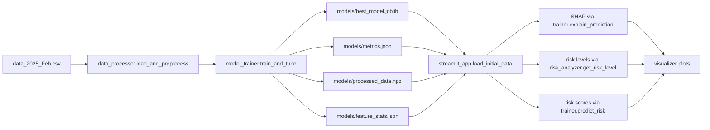

# XAI_CODEBASE_AUDIT

## 1) Scope and Objective
This audit reviews the legacy XAI stack in HAI-App and assesses migration readiness to a new feature-group framework.

Primary audited implementation files:
- HAI-App/config.py
- HAI-App/data_processor.py
- HAI-App/risk_analyzer.py
- HAI-App/visualizer.py
- HAI-App/model_trainer.py
- HAI-App/streamlit_app.py

Audited documentation files:
- HAI-App/risk_analyzer.md
- HAI-App/visualizer.md
- HAI-App/streamlit_app.md
- HAI-App/config.md

Additional XAI-related discovery scope:
- Optiona_internship (scripts/notebooks)
- notebooks (main analysis notebooks)

## 2) File Inventory (audited)
- config.py: 142 lines
- data_processor.py: 91 lines
- risk_analyzer.py: 221 lines
- visualizer.py: 331 lines
- model_trainer.py: 534 lines
- streamlit_app.py: 685 lines
- risk_analyzer.md: 17 lines
- visualizer.md: 17 lines
- streamlit_app.md: 21 lines
- config.md: 15 lines

## 3) Findings (ordered by severity)

### Critical
1. Scalar-indexing bug in feature ranking (runtime failure risk)
- streamlit_app.py uses key=lambda x: abs(x[1][0]) at lines 379 and 421.
- In the current data flow, x[1] is often a scalar float (not a vector), so x[1][0] can raise indexing errors.
- Impact: Population and individual top-feature panels can fail at runtime.

### High
2. Feature-group schema is hardcoded in multiple places and already diverges
- Group definitions appear in config.py (line 89+) and risk_analyzer.py (line 40+).
- visualizer.py has its own mapping (feature_group_mapping at line 303+) and includes fewer Staff Resources features than config.py.
- config.py includes temporal features (month/day/day_of_week/is_weekend) under Patient Characteristics, while visualizer mapping omits them.
- Impact: Inconsistent group attribution, visualization drift, and migration brittleness.

3. SHAP output shape handling is version/model fragile
- model_trainer.py returns explainer.shap_values(X) directly (line 486), which can be list/array depending SHAP version/model.
- risk_analyzer.py assumes index [0] after shap_values call (line 148).
- streamlit_app.py contains defensive but ad-hoc shape handling and class toggles (lines 452-477).
- Impact: Intermittent compatibility errors and inconsistent interpretation semantics.

### Medium
4. Strict required-feature validation blocks schema evolution
- risk_analyzer.py _initialize_feature_groups raises on any missing required features (line 87).
- Impact: New datasets or renamed features fail hard instead of degrading gracefully.

5. Artifact contracts are implicit and path-coupled
- train_models.py writes a fixed artifact set into models/ (lines 22-25).
- streamlit_app.py requires those exact files and stops if missing (lines 51-53).
- Impact: Deployment portability and CI reproducibility are fragile without explicit schema/versioning metadata.

6. Documentation markdown files are high-level and stale versus code specifics
- risk_analyzer.md, visualizer.md, streamlit_app.md, config.md are conceptual summaries and do not capture real edge-case handling or current method signatures.
- Impact: Developer onboarding and maintenance risk.

## 4) File-by-File Method-Level Documentation

### config.py
Purpose:
- Central static configuration for model hyperparameter search spaces, train settings, risk thresholds, feature groups, and visualization defaults.

Key blocks:
- MODEL_CONFIG (line 11): model-specific HPO spaces for xgboost/lightgbm/catboost/random_forest.
- TRAIN_CONFIG (line 68): split ratio, CV folds, trial counts, random seed, learning-curve settings.
- RISK_LEVELS (line 80): 5-level probability bins.
- FEATURE_GROUPS (line 89): old 6-group schema with explicit feature lists.
- VIZ_CONFIG (line 127): group colors and plot defaults.

Notes:
- This file is authoritative for old grouping but not enforced as single-source-of-truth across all modules.

### data_processor.py
Class:
- DataProcessor

Methods:
- __init__(): initializes label_encoders dict.
- load_and_preprocess(data_path):
  - Loads CSV.
  - Median-imputes numeric missing values.
  - Label-encodes selected categorical columns.
  - Builds date column from year/month/day or synthetic year fallback.
  - Temporal split using last ~20% (bounded), fallback to stratified split if class collapse.
  - Returns X_train, X_test, y_train, y_test, feature names.

Data expectations:
- Target column: has_infection.
- Date components expected: month/day (+ optional year).
- Categorical set hardcoded: sex, diagnosis, origin_2...origin_9.

### risk_analyzer.py
Data class:
- AnalysisResult: top_features, group_contributions, shap_values, risk_score, risk_level, feature_statistics.

Class:
- RiskAnalyzer

Methods:
- __init__(output_dir='model_outputs'):
  - Initializes output dir.
  - Hardcoded risk_levels and feature_groups (old schema).
  - Initializes scalers/stats containers.
- _initialize_feature_groups(columns):
  - Validates all required features exist.
  - Warns on uncategorized features.
- get_risk_level(risk_score):
  - Type/range validation; maps to risk_levels bins.
- calculate_feature_statistics(data):
  - Precomputes per-feature summary stats.
- analyze_patient(patient_data, model, feature_names, calculate_relative_risk=True):
  - Input validation.
  - SHAP extraction from model.explainer.
  - risk_score via model.predict_proba(...)[1].
  - Top feature ranking and group contributions.
  - Optional feature percentile context.
  - Returns AnalysisResult.
- _calculate_group_contributions(feature_names, shap_values):
  - Sums absolute SHAP per configured group.
- _calculate_percentile(value, stats):
  - Min-max percentile estimate.
- save_analysis(analysis_result, patient_id):
  - Saves selected outputs as JSON.

### visualizer.py
Class:
- Visualizer

Methods:
- __init__(): group colors + color scale.
- _safe_convert_to_float(value): robust conversion helper.
- plot_feature_importance(top_features, feature_stats, patient_data):
  - Horizontal bar chart with hover details.
  - Group coloring uses feature_group_mapping().
- plot_group_contributions(group_contributions):
  - Donut chart by group.
- plot_shap_waterfall(shap_values, feature_names, expected_value, class_index=0):
  - Waterfall-style interpretation plot; handles some multi-class shapes.
- feature_group_mapping() [static]:
  - Internal hardcoded map (not synchronized with config.py full lists).

### model_trainer.py
Class:
- ModelTrainer

Methods:
- __init__(model_dir=MODEL_DIR): model registry, params, output dirs.
- create_objective(model_name, X_train, y_train): Optuna objective with CV AUC.
- optimize_hyperparameters(model_name, X_train, y_train, n_trials=None): study run.
- evaluate_model(model, X, y): accuracy/AUC/precision/recall/F1 (with edge-case guards).
- train_and_tune(X_train, X_test, y_train, y_test, n_trials=None):
  - HPO for all model families.
  - Learner-specific fitting, early stopping, learning curve capture.
  - Model comparison export.
  - Best model selection + final fit + TreeExplainer init.
- _save_learning_curves_data(): writes learning_curves.json.
- plot_combined_learning_curves(...): writes combined plot HTML.
- _save_optimization_results(...): writes optimization JSON + plots.
- predict_risk(X): predict_proba positive class.
- explain_prediction(X): returns raw SHAP from explainer.
- save_model(model_name, add_timestamp=False): joblib + metadata JSON.
- load_model(model_path): restores model/explainer/metadata.
- get_feature_importance(feature_names): model-native importance fallback.

### streamlit_app.py
Purpose:
- Dashboard orchestration and user interface.

Top-level functions:
- initialize_components(): cached creation of DataProcessor/ModelTrainer/RiskAnalyzer/Visualizer.
- load_initial_data():
  - Verifies artifact presence.
  - Loads model + processed arrays + metrics + feature stats.
  - Initializes analyzer feature groups.
  - Computes risk scores, risk levels, SHAP values, expected value.
- update_filtered_data(): applies risk-level filters to data and SHAP arrays.
- on_risk_level_change(): callback for filter updates.
- on_patient_select(): callback for patient selection validity.
- create_metric_with_bar(...): UI helper for metric cards.

Interface sections:
- Key metrics and risk-category counts.
- Population-level feature/group contribution plots.
- Individual patient SHAP + waterfall interpretation.
- Model comparison visualization.
- Feature dictionary appendix.

## 5) Dependency and Execution Map

Cross-module coupling points:
- Group definitions are duplicated across config.py, risk_analyzer.py, and visualizer.py.
- SHAP data contract is shared informally between model_trainer.py, risk_analyzer.py, and streamlit_app.py.

## 6) Data Format Contract (current state)

### Runtime input dataset
- Required target: has_infection.
- Expected feature family includes demographics, procedure, occupancy, LOS, staffing, and condition flags.
- Temporal columns expected for date reconstruction: month/day (+ optional year).

### Training artifacts generated by train_models.py
1. models/best_model.joblib
- Dict with keys:
  - model: fitted estimator
  - explainer: SHAP explainer object

2. models/metrics.json
- JSON object with keys:
  - accuracy, auc_roc, precision, recall, f1

3. models/processed_data.npz
- Arrays:
  - X_train [n_train, n_features]
  - X_test [n_test, n_features]
  - y_train [n_train]
  - y_test [n_test]
  - features [n_features]

4. models/feature_stats.json
- Mapping:
  - feature -> {min, max, mean, std}

### Analysis contract
- risk_score: model.predict_proba(x)[1]
- risk_level: interval mapping from configured bins
- shap_values: version/model dependent array/list from SHAP explainer

## 7) Old vs New Feature-Group Mapping

New target scheme (provided):
- Medical Procedures (50.2%)
- Organizational Staffing (19.4%)
- Organizational Environment (7.6%)
- Temporal (6.8%)
- Clinical Severity (6.6%)
- Length of Stay (5.7%)
- Patient Demographics (3.7%)

Mapping from legacy groups:

| Legacy Group | Representative Legacy Features | Recommended New Group(s) |
|---|---|---|
| Patient Characteristics | age_years, sex, igsII, diagnosis, origin_*, month/day/day_of_week/is_weekend | Patient Demographics (age/sex), Temporal (month/day/day_of_week/is_weekend), Clinical Severity (igsII/diagnosis/origin_*) |
| Medical Procedures | intubation_duration, urinary_duration, kt_count, intubated, reintubated | Medical Procedures |
| Hospital Environment | bed_occupancy, patient_turnover, bed_occupancy_rate | Organizational Environment |
| Length of Stay Metrics | LOS, Gross_LOS_Per_Medical_Unit, National_Avg_LOS, Overall_LOS, Ratio_Overall_LOS_Over_National_Avg_LOS | Length of Stay |
| Staff Resources | ETP_* and Count_* staffing features | Organizational Staffing |
| Medical Conditions | immuno_*, antibio_*, cancer_*, trauma_* | Clinical Severity |

Important nuance:
- Legacy has no explicit standalone Temporal or Patient Demographics groups; these are currently embedded in Patient Characteristics.
- New schema separates them, which is a beneficial normalization.

## 8) Equations and Risk Logic Alignment

Current implemented logic:
1. Probability score
- risk_score = P(y=1 | x) = model.predict_proba(x)[1]

2. Risk category mapping
- Very Low: [0.0, 0.2)
- Low: [0.2, 0.4)
- Moderate: [0.4, 0.6)
- High: [0.6, 0.8)
- Very High: [0.8, 1.0]

3. SHAP additive interpretation
- Tree SHAP gives per-feature contributions phi_i and expected value phi_0.
- Model output is interpreted as additive: f(x) ~= phi_0 + sum_i(phi_i).

Legacy notebook equation caveat (Optiona_internship/xgboost.ipynb):
- A prototype forces base_prob = 0.0 before distributing SHAP proportional impacts.
- This is not a mathematically clean probability decomposition and should not be ported.

## 9) Seven Assessment Answers

Q1. Can the old framework be reused directly?
- Partially. Reusable: training orchestration, artifact loading, dashboard skeleton, SHAP plotting utilities.
- Not directly reusable without edits: group definitions, SHAP shape assumptions, and top-feature ranking logic.

Q2. Are current visualizations migration-ready?
- Partially. Chart infrastructure is reusable.
- Group mapping logic must be centralized and synchronized before migration.

Q3. Is Streamlit update viable without rewrite?
- Yes. A targeted refactor is sufficient (no full rewrite required).

Q4. Do equations align with new framework needs?
- Core score and SHAP additive logic align.
- One notebook prototype contains a forced baseline shortcut that should be excluded.

Q5. Minimum required code changes?
- Introduce one canonical feature-group registry used by analyzer + visualizer + app.
- Fix scalar indexing bug in streamlit_app.py for top-feature sorting.
- Normalize SHAP outputs into one internal format (n_samples, n_features) for binary workflows.
- Add artifact schema/version metadata and validation.

Q6. What outputs are missing for robust operations?
- Explicit schema/version manifest for artifacts.
- Centralized feature dictionary and group mapping source file.
- Automated validation tests for SHAP shape and group coverage.

Q7. Should this dashboard be recommended for production now?
- Not yet. Recommend conditional approval after targeted remediation and validation tests.

## 10) Additional XAI-Related Files Found (outside HAI-App)

### Optiona_internship
- Optiona_internship/data_processing.ipynb
- Optiona_internship/starting_again.ipynb
- Optiona_internship/test.py
- Optiona_internship/testing_given_paper.ipynb
- Optiona_internship/xgboost.ipynb
- Optiona_internship/xgboost_copy.ipynb
- Optiona_internship/xgboost_copy_27_Feb.ipynb
- Optiona_internship/xgboost_optimized.ipynb

Observed pattern:
- Multiple notebook-era SHAP experiments and risk-level prototypes.
- Optiona_internship/test.py contains a Flask API prototype with SHAP and risk-level thresholds.

### notebooks
- notebooks/Analysis_with_synthetic_data_Updated_approach.ipynb
- notebooks/Analysis_with_synthetic_data_Updated_Approch_3.ipynb
- notebooks/Analysis_with_synthetic_data_Updated_Approch_3_on_updated_data.ipynb
- notebooks/Hypothesis_3.ipynb
- notebooks/New_ETP_DATA/Analysis_with_New_ETP_Data copy.ipynb
- notebooks/New_ETP_DATA/Analysis_with_New_ETP_Data.ipynb
- notebooks/New_ETP_DATA/test.ipynb

Observed pattern:
- SHAP summary/dependence/interpretability experiments used in research workflows.
- These notebooks are valuable references but should not be treated as deployment-grade source of truth.

## 11) Recommended Migration Plan

Phase 1: Stabilize
- Fix streamlit top-feature scalar indexing bug.
- Add SHAP normalization helper used by trainer/analyzer/app.
- Centralize group mapping into one module (single source of truth).

Phase 2: Migrate groups
- Implement explicit 7-group schema.
- Add feature-to-group completeness checks and migration report.

Phase 3: Harden
- Add artifact manifest with schema version and model metadata.
- Add unit tests for group mapping coverage, SHAP shape invariants, and risk-level mapping boundaries.

Phase 4: Validate
- Run side-by-side comparison old vs new dashboard outputs on the same frozen test set.
- Approve production rollout only after no-critical regression criteria are met.

---

# Appendix A: Full Source Listings
The following sections include complete source listings for the requested files.
## Full Source Listing: config.py

Source file: D:\My_data\Internship\HAI\Data_analysis\HAI_April_2026\HAI-App\config.py

    """Configuration settings for the application."""
    
    import os
    
    # Paths
    DATA_DIR = 'data'
    MODEL_DIR = 'models'
    OUTPUT_DIR = 'outputs'
    
    # Model training settings
    MODEL_CONFIG = {
        'xgboost': {
            'param_space': {
                'max_depth': {'type': 'int', 'range': (3, 12)},
                'learning_rate': {'type': 'float', 'range': (0.001, 0.3)},
                'n_estimators': {'type': 'int', 'range': (50, 1000)},
                'min_child_weight': {'type': 'int', 'range': (1, 7)},
                'subsample': {'type': 'float', 'range': (0.6, 1.0)},
                'colsample_bytree': {'type': 'float', 'range': (0.6, 1.0)},
                'gamma': {'type': 'float', 'range': (0, 0.5)}
            },
            'fixed_params': {
                'eval_metric': 'logloss',
                'objective': 'binary:logistic'
            }
        },
        'lightgbm': {
            'param_space': {
                'num_leaves': {'type': 'int', 'range': (20, 200)},
                'learning_rate': {'type': 'float', 'range': (0.001, 0.3)},
                'n_estimators': {'type': 'int', 'range': (50, 1000)},
                'min_child_samples': {'type': 'int', 'range': (10, 100)},
                'subsample': {'type': 'float', 'range': (0.6, 1.0)},
                'colsample_bytree': {'type': 'float', 'range': (0.6, 1.0)},
                'reg_alpha': {'type': 'float', 'range': (0, 10.0)},
                'reg_lambda': {'type': 'float', 'range': (0, 10.0)}
            },
            'fixed_params': {
                'objective': 'binary',
                'metric': 'binary_logloss',
                'verbose': -1
            }
        },
        'catboost': {
            'param_space': {
                'depth': {'type': 'int', 'range': (4, 10)},
                'learning_rate': {'type': 'float', 'range': (0.001, 0.3)},
                'iterations': {'type': 'int', 'range': (50, 1000)},
                'l2_leaf_reg': {'type': 'float', 'range': (1, 10)},
                'border_count': {'type': 'int', 'range': (32, 255)}
            },
            'fixed_params': {
                'verbose': False
            }
        },
        'random_forest': {
            'param_space': {
                'n_estimators': {'type': 'int', 'range': (50, 1000)},
                'max_depth': {'type': 'int', 'range': (3, 20)},
                'min_samples_split': {'type': 'int', 'range': (2, 20)},
                'min_samples_leaf': {'type': 'int', 'range': (1, 10)}
            },
            'fixed_params': {}
        }
    }
    
    # Training settings
    TRAIN_CONFIG = {
        'test_size': 0.2,
        'random_state': 42,
        'n_trials': 100,
        'cv_folds': 5,
        'n_jobs': -1,
        'learning_curve_points': 5,  # Number of points (training sizes) for RF learning curve
        'cv_folds_learning_curve': 3, # CV folds for RF learning curve generation
        'n_jobs_learning_curve': -1, # Parallel jobs for RF learning curve generation
    }
    
    # Risk levels
    RISK_LEVELS = {
        'Very Low': (0, 0.2),
        'Low': (0.2, 0.4),
        'Moderate': (0.4, 0.6),
        'High': (0.6, 0.8),
        'Very High': (0.8, 1.0)
    }
    
    # Feature groups
    FEATURE_GROUPS = {
        'Patient Characteristics': [
            'age_years', 'sex', 'igsII', 'diagnosis',
            'origin_2', 'origin_3', 'origin_4', 'origin_5',
            'origin_6', 'origin_7', 'origin_8', 'origin_9',
            'month', 'day', 'day_of_week', 'is_weekend'
        ],
        'Medical Procedures': [
            'intubation_duration', 'urinary_duration', 'kt_count',
            'intubated', 'reintubated'
        ],
        'Hospital Environment': [
            'bed_occupancy', 'patient_turnover', 'bed_occupancy_rate'
        ],
        'Length of Stay Metrics': [
            'LOS', 'Gross_LOS_Per_Medical_Unit', 'National_Avg_LOS',
            'Overall_LOS', 'Ratio_Overall_LOS_Over_National_Avg_LOS'
        ],
        'Staff Resources': [
            'ETP_Total_General_Nurse', 'Count_Total_General_Nurse',
            'ETP_Total_Medical_Administrative_Assistant',
            'ETP_Total_Nurse_Anesthetist_Health_Manager',
            'Count_Total_Nurse_Anesthetist_Health_Manager',
            'ETP_Total_Nursing_Assistant', 'Count_Total_Nursing_Assistant',
            'ETP_Total_Dietitian', 'Count_Total_Dietitian',
            'ETP_Total_Hospital_Services_Agent', 'Count_Total_Hospital_Services_Agent',
            'ETP_Total_Administrative_Assistant', 'Count_Total_Administrative_Assistant',
            'ETP_Total_All', 'Count_Total_All'
        ],
        'Medical Conditions': [
            'immuno_2', 'immuno_3', 'immuno_9',
            'antibio_2', 'antibio_9',
            'cancer_2', 'cancer_3', 'cancer_9',
            'trauma_2', 'trauma_9'
        ]
    }
    
    # Visualization settings
    VIZ_CONFIG = {
        'colors': {
            'Patient Characteristics': '#1f77b4',
            'Medical Procedures': '#ff7f0e',
            'Hospital Environment': '#2ca02c',
            'Length of Stay Metrics': '#d62728',
            'Staff Resources': '#9467bd',
            'Medical Conditions': '#8c564b'
        },
        'plot_height': 500,
        'plot_width': 800
    }
    
    # Create directories if they don't exist
    for directory in [DATA_DIR, MODEL_DIR, OUTPUT_DIR]:
        os.makedirs(directory, exist_ok=True) 
## Full Source Listing: data_processor.py

Source file: D:\My_data\Internship\HAI\Data_analysis\HAI_April_2026\HAI-App\data_processor.py

    import pandas as pd
    from sklearn.model_selection import train_test_split
    from sklearn.preprocessing import LabelEncoder
    
    class DataProcessor:
        def __init__(self):
            self.label_encoders = {}
            
        def load_and_preprocess(self, data_path):
            """Load and preprocess the dataset with temporal split to avoid data leakage"""
            df = pd.read_csv(data_path)
            
            # Handle missing values before encoding
            # For numerical columns: fill with median
            # For categorical columns: fill with mode or 'unknown'
            print(f"\nInitial data shape: {df.shape}")
            print(f"Missing values: {df.isna().sum().sum()}")
            
            # Identify numerical and categorical columns (excluding target)
            numerical_cols = df.select_dtypes(include=['int64', 'float64']).columns.tolist()
            if 'has_infection' in numerical_cols:
                numerical_cols.remove('has_infection')
            
            # Fill numerical missing values with median
            for col in numerical_cols:
                if df[col].isna().sum() > 0:
                    df[col] = df[col].fillna(df[col].median())
    
            # Encode categorical variables
            categorical_cols = ['sex', 'diagnosis', 'origin_2', 'origin_3', 'origin_4', 
                              'origin_5', 'origin_6', 'origin_7', 'origin_8', 'origin_9']
    
            for col in categorical_cols:
                if col in df.columns:
                    # Fill missing categorical values with mode or 'unknown'
                    if df[col].isna().sum() > 0:
                        df[col] = df[col].fillna(df[col].mode()[0] if len(df[col].mode()) > 0 else 'unknown')
                    self.label_encoders[col] = LabelEncoder()
                    df[col] = self.label_encoders[col].fit_transform(df[col])
            
            print(f"After handling missing values: {df.isna().sum().sum()} NaN remaining")
    
            # Create a datetime column for temporal sorting
            # Assume data is from 2018 to 2020, and sorted by year, month, day
            # If year column is missing, assume data is already sorted chronologically
            if 'year' in df.columns:
                df['date'] = pd.to_datetime(df[['year', 'month', 'day']])
            else:
                # If no year, assume all data is in order and use a fake year (e.g., 2020)
                df['date'] = pd.to_datetime({'year': 2020, 'month': df['month'], 'day': df['day']})
    
            df = df.sort_values('date')
    
            # Use temporal split with minimum test set size
            # Strategy: Use last 20% of data (by time) as test set, with minimum of 100 samples
            test_size = max(int(len(df) * 0.2), 100)
            test_size = min(test_size, int(len(df) * 0.3))  # Cap at 30% to ensure enough training data
            
            # Split temporally: last test_size records are test set
            train_df = df.iloc[:-test_size]
            test_df = df.iloc[-test_size:]
            
            # Verify both classes are present in both sets
            train_classes = train_df['has_infection'].nunique()
            test_classes = test_df['has_infection'].nunique()
            
            print(f"\nTemporal split: {len(train_df)} train samples, {len(test_df)} test samples")
            print(f"Train classes: {train_classes}, Test classes: {test_classes}")
            
            # If test set doesn't have both classes, fall back to stratified split
            if train_classes < 2 or test_classes < 2:
                print("⚠️  Temporal split resulted in single-class dataset. Using stratified split instead.")
                # Drop date column before stratified split
                features_df = df.drop(['has_infection', 'date'], axis=1)
                target = df['has_infection']
                
                X_train, X_test, y_train, y_test = train_test_split(
                    features_df, target, 
                    test_size=0.2, 
                    random_state=42, 
                    stratify=target
                )
                return X_train, X_test, y_train, y_test, X_train.columns
            
            # Split features and target
            X_train = train_df.drop(['has_infection', 'date'], axis=1)
            y_train = train_df['has_infection']
            X_test = test_df.drop(['has_infection', 'date'], axis=1)
            y_test = test_df['has_infection']
    
            return X_train, X_test, y_train, y_test, X_train.columns
    
## Full Source Listing: risk_analyzer.py

Source file: D:\My_data\Internship\HAI\Data_analysis\HAI_April_2026\HAI-App\risk_analyzer.py

    import os
    import numpy as np
    import pandas as pd
    from typing import Dict, List, Tuple, Union, Optional
    import json
    from dataclasses import dataclass
    from sklearn.preprocessing import StandardScaler
    
    @dataclass
    class AnalysisResult:
        """Data class to store analysis results"""
        top_features: Dict[str, float]
        group_contributions: Dict[str, float]
        shap_values: Dict[str, float]
        risk_score: float
        risk_level: str
        feature_statistics: Dict[str, Dict[str, float]]
    
    class RiskAnalyzer:
        def __init__(self, output_dir: str = 'model_outputs'):
            """
            Initialize RiskAnalyzer with clinically defined risk levels and feature groups.
            
            Args:
                output_dir: Directory for saving analysis outputs
            """
            self.output_dir = output_dir
            os.makedirs(output_dir, exist_ok=True)
            
            # Clinically defined risk levels - DO NOT MODIFY
            self.risk_levels = {
                'Very Low': (0, 0.2),
                'Low': (0.2, 0.4),
                'Moderate': (0.4, 0.6),
                'High': (0.6, 0.8),
                'Very High': (0.8, 1.0)
            }
            
            # Clinically defined feature groups - DO NOT MODIFY
            self.feature_groups = {
                'Patient Characteristics': [
                    'age_years', 'sex', 'igsII', 'diagnosis',
                    'origin_2', 'origin_3', 'origin_4', 'origin_5',
                    'origin_6', 'origin_7', 'origin_8', 'origin_9',
                    'month', 'day', 'day_of_week', 'is_weekend'
                ],
                'Medical Procedures': [
                    'intubation_duration', 'urinary_duration', 'kt_count',
                    'intubated', 'reintubated'
                ],
                'Hospital Environment': [
                    'bed_occupancy', 'patient_turnover', 'bed_occupancy_rate'
                ],
                'Length of Stay Metrics': [
                    'LOS', 'Gross_LOS_Per_Medical_Unit', 'National_Avg_LOS',
                    'Overall_LOS', 'Ratio_Overall_LOS_Over_National_Avg_LOS'
                ],
                'Staff Resources': [
                    'ETP_Total_General_Nurse', 'Count_Total_General_Nurse',
                    'ETP_Total_Medical_Administrative_Assistant',
                    'ETP_Total_Nurse_Anesthetist_Health_Manager',
                    'Count_Total_Nurse_Anesthetist_Health_Manager',
                    'ETP_Total_Nursing_Assistant', 'Count_Total_Nursing_Assistant',
                    'ETP_Total_Dietitian', 'Count_Total_Dietitian',
                    'ETP_Total_Hospital_Services_Agent', 'Count_Total_Hospital_Services_Agent',
                    'ETP_Total_Administrative_Assistant', 'Count_Total_Administrative_Assistant',
                    'ETP_Total_All', 'Count_Total_All'
                ],
                'Medical Conditions': [
                    'immuno_2', 'immuno_3', 'immuno_9',
                    'antibio_2', 'antibio_9',
                    'cancer_2', 'cancer_3', 'cancer_9',
                    'trauma_2', 'trauma_9'
                ]
            }
            
            self.scaler = StandardScaler()
            self.feature_statistics = {}
            self.population_statistics = {}
    
        def _initialize_feature_groups(self, columns: List[str]) -> None:
            """Validate feature groups against available columns"""
            # Validate that required features are present
            all_required_features = set(sum(self.feature_groups.values(), []))
            missing_features = all_required_features - set(columns)
            if missing_features:
                raise ValueError(f"Missing required features in dataset: {missing_features}")
                
            # Check for any uncategorized features
            uncategorized = set(columns) - all_required_features
            if uncategorized:
                print(f"Warning: Uncategorized features found: {uncategorized}")
        
        def get_risk_level(self, risk_score: float) -> str:
            """Get risk level category with input validation"""
            # Convert numpy types to float
            if hasattr(risk_score, 'item'):
                risk_score = float(risk_score)
                
            if not isinstance(risk_score, (int, float, np.integer, np.floating)):
                raise TypeError("Risk score must be a number")
                
            if not 0 <= risk_score <= 1:
                raise ValueError("Risk score must be between 0 and 1")
                
            for level, (lower, upper) in self.risk_levels.items():
                if lower <= risk_score < upper:
                    return level
            return 'Very High' if risk_score >= 1 else 'Very Low'
        
        def calculate_feature_statistics(self, data: pd.DataFrame) -> None:
            """Calculate and store feature statistics"""
            self.feature_statistics = {
                col: {
                    'min': data[col].min(),
                    'max': data[col].max(),
                    'mean': data[col].mean(),
                    'median': data[col].median(),
                    'std': data[col].std(),
                    'q25': data[col].quantile(0.25),
                    'q75': data[col].quantile(0.75)
                } for col in data.columns
            }
        
        def analyze_patient(self, 
                           patient_data: pd.Series, 
                           model: any, 
                           feature_names: List[str],
                           calculate_relative_risk: bool = True) -> AnalysisResult:
            """
            Analyze individual patient data with enhanced functionality
            
            Args:
                patient_data: Patient data as pandas Series
                model: Trained model with explainer
                feature_names: List of feature names
                calculate_relative_risk: Whether to calculate relative risk compared to population
            """
            # Input validation
            if not isinstance(patient_data, pd.Series):
                raise TypeError("patient_data must be a pandas Series")
            if not all(f in patient_data.index for f in feature_names):
                missing = [f for f in feature_names if f not in patient_data.index]
                raise ValueError(f"Missing features in patient data: {missing}")
            
            # Get SHAP values
            try:
                shap_values = model.explainer.shap_values(patient_data.values.reshape(1, -1))[0]
            except Exception as e:
                raise RuntimeError(f"Error calculating SHAP values: {str(e)}")
            
            # Calculate risk score
            risk_score = model.predict_proba(patient_data.values.reshape(1, -1))[0][1]
            
            # Get feature importance
            importance_dict = dict(zip(feature_names, np.abs(shap_values)))
            top_features = dict(sorted(importance_dict.items(), key=lambda x: abs(x[1]), reverse=True)[:10])
            
            # Calculate group contributions
            group_contributions = self._calculate_group_contributions(feature_names, shap_values)
            
            # Calculate feature statistics if available
            feature_stats = {}
            if self.feature_statistics:
                feature_stats = {
                    feature: {
                        'value': patient_data[feature],
                        'percentile': self._calculate_percentile(
                            patient_data[feature],
                            self.feature_statistics[feature]
                        ),
                        **self.feature_statistics[feature]
                    }
                    for feature in feature_names
                }
            
            return AnalysisResult(
                top_features=top_features,
                group_contributions=group_contributions,
                shap_values=dict(zip(feature_names, shap_values)),
                risk_score=risk_score,
                risk_level=self.get_risk_level(risk_score),
                feature_statistics=feature_stats
            )
        
        def _calculate_group_contributions(self, 
                                        feature_names: List[str], 
                                        shap_values: np.ndarray) -> Dict[str, float]:
            """Calculate feature group contributions with validation"""
            if self.feature_groups is None:
                raise ValueError("Feature groups not initialized")
                
            group_contributions = {}
            for group, features in self.feature_groups.items():
                valid_features = [f for f in features if f in feature_names]
                if not valid_features:
                    continue
                contribution = sum(abs(shap_values[list(feature_names).index(f)]) 
                                 for f in valid_features)
                group_contributions[group] = contribution
            
            return group_contributions
        
        @staticmethod
        def _calculate_percentile(value: float, stats: Dict[str, float]) -> float:
            """Calculate the percentile of a value within its distribution"""
            if stats['max'] == stats['min']:
                return 0.5
            return (value - stats['min']) / (stats['max'] - stats['min'])
        
        def save_analysis(self, analysis_result: AnalysisResult, patient_id: str) -> None:
            """Save analysis results to file"""
            output_path = os.path.join(self.output_dir, f"analysis_{patient_id}.json")
            with open(output_path, 'w') as f:
                json.dump({
                    'risk_score': analysis_result.risk_score,
                    'risk_level': analysis_result.risk_level,
                    'top_features': analysis_result.top_features,
                    'group_contributions': analysis_result.group_contributions,
                    'feature_statistics': analysis_result.feature_statistics
                }, f, indent=4)
## Full Source Listing: visualizer.py

Source file: D:\My_data\Internship\HAI\Data_analysis\HAI_April_2026\HAI-App\visualizer.py

    import plotly.graph_objects as go
    import plotly.express as px
    import numpy as np
    import pandas as pd
    from typing import Dict, Union, List
    
    class Visualizer:
        def __init__(self):
            # Define consistent colors for feature groups
            self.group_colors = {
                'Patient Characteristics': '#1f77b4',
                'Medical Procedures': '#ff7f0e',
                'Hospital Environment': '#2ca02c',
                'Length of Stay Metrics': '#d62728',
                'Staff Resources': '#9467bd',
                'Medical Conditions': '#8c564b'
            }
            self.color_scale = px.colors.sequential.Blues
    
        def _safe_convert_to_float(self, value: Union[np.ndarray, list, float]) -> float:
            """Safely convert any numeric input to float"""
            try:
                if isinstance(value, (np.ndarray, list)):
                    if len(value) > 0:
                        return float(np.mean(value))
                    return 0.0
                if hasattr(value, 'item'):
                    return float(value.item())
                return float(value)
            except (TypeError, ValueError) as e:
                print(f"Warning: Conversion error - {str(e)}")
                return 0.0
    
        def plot_feature_importance(self, 
                                  top_features: Dict[str, Union[np.ndarray, float]], 
                                  feature_stats: Dict,
                                  patient_data: Dict) -> go.Figure:
            """Create interactive bar plot of top feature importance"""
            # Process all feature values to ensure they're floats
            processed_features = {
                feat: self._safe_convert_to_float(val) 
                for feat, val in top_features.items()
            }
            
            # Sort features by absolute importance
            sorted_features = dict(sorted(
                processed_features.items(),
                key=lambda x: abs(x[1]),
                reverse=True
            ))
            
            # Map features to their groups
            feature_groups = {}
            group_map = self.feature_group_mapping()
            for feat in sorted_features:
                feature_groups[feat] = next(
                    (group for group, features in group_map.items() if feat in features),
                    'Other'
                )
    
            # Prepare hover text
            hover_text = []
            for feat, val in sorted_features.items():
                try:
                    patient_val = self._safe_convert_to_float(patient_data.get(feat, np.nan))
                    stats = feature_stats.get(feat, {})
                    hover_text.append(
                        f"<b>{feat}</b> "
                        f"Group: {feature_groups[feat]} "
                        f"Importance: {val:.3f} "
                        f"Current Value: {patient_val:.3f} "
                        f"Min: {self._safe_convert_to_float(stats.get('min', np.nan)):.3f} "
                        f"Mean: {self._safe_convert_to_float(stats.get('mean', np.nan)):.3f} "
                        f"Max: {self._safe_convert_to_float(stats.get('max', np.nan)):.3f}"
                    )
                except Exception as e:
                    print(f"Warning: Couldn't generate hover for {feat}: {str(e)}")
                    hover_text.append(f"<b>{feat}</b> Importance: {val:.3f}")
    
            # Create figure
            fig = go.Figure(
                go.Bar(
                    x=list(sorted_features.values()),
                    y=list(sorted_features.keys()),
                    orientation='h',
                    marker_color=[self.group_colors.get(feature_groups[feat], '#808080') 
                                for feat in sorted_features],
                    text=[f"{val:.3f}" for val in sorted_features.values()],
                    textposition='auto',
                    hoverinfo='text',
                    hovertext=hover_text
                )
            )
            
            # Style layout
            fig.update_layout(
                title='<b>Feature Importance Analysis</b>',
                xaxis_title='<b>Feature Importance</b>',
                yaxis_title='<b>Feature</b>',
                height=max(500, 30 * len(sorted_features)),
                template='plotly_white',
                margin=dict(l=150, r=50, t=100, b=50)
            )
            
            return fig
    
        def plot_group_contributions(self, 
                                   group_contributions: Dict[str, Union[np.ndarray, float]]) -> go.Figure:
            """Create interactive doughnut chart of feature group contributions"""
            # Process all contributions to floats
            processed = {
                group: self._safe_convert_to_float(val)
                for group, val in group_contributions.items()
            }
            
            # Define consistent order
            group_order = [
                'Patient Characteristics',
                'Medical Procedures',
                'Hospital Environment',
                'Length of Stay Metrics',
                'Staff Resources',
                'Medical Conditions'
            ]
            
            # Sort groups by predefined order
            sorted_groups = sorted(
                processed.keys(),
                key=lambda x: (group_order.index(x) if x in group_order else len(group_order), x)
            )
            
            # Prepare data for plotting
            labels = []
            values = []
            for group in sorted_groups:
                val = processed[group]
                if val != 0:  # Skip zero contributions
                    labels.append(group)
                    values.append(val)
            
            # Create figure
            fig = go.Figure(
                go.Pie(
                    labels=labels,
                    values=values,
                    hole=0.4,
                    marker_colors=[self.group_colors.get(group, '#808080') for group in labels],
                    textinfo='percent',
                    textposition='outside',
                    hoverinfo='label+value+percent',
                    sort=False
                )
            )
            
            # Style layout
            fig.update_layout(
                title='<b>Feature Group Contributions</b>',
                height=500,
                showlegend=True,
                legend=dict(
                    orientation='h',
                    yanchor='bottom',
                    y=-0.2,
                    xanchor='center',
                    x=0.5
                ),
                margin=dict(l=20, r=20, t=80, b=80)
            )
            
            return fig
    
        def plot_shap_waterfall(self,
                          shap_values: Union[np.ndarray, list],
                          feature_names: Union[List[str], np.ndarray],
                          expected_value: Union[float, np.ndarray],
                          class_index: int = 0) -> (go.Figure, str):
            """Create waterfall plot of SHAP values
            
            Args:
                shap_values: SHAP values array (can be 1D or 2D for multi-class)
                feature_names: List of feature names
                expected_value: Base value
                class_index: Which class to show (0 for negative/background, 1 for positive)
            """
            # Convert and validate inputs
            try:
                shap_values = np.asarray(shap_values, dtype=np.float64)
                
                # Handle multi-class SHAP values (2D array)
                if len(shap_values.shape) == 2:
                    if class_index >= shap_values.shape[0]:
                        raise ValueError(f"class_index {class_index} is out of bounds for SHAP values with {shap_values.shape[0]} classes")
                    shap_values = shap_values[class_index]  # Select specific class
                
                shap_values = shap_values.flatten()
                
                # Convert feature_names
                if isinstance(feature_names, np.ndarray):
                    feature_names = feature_names.tolist()
                feature_names = list(feature_names)
                
                # Handle expected_value (can be array for multi-class)
                if isinstance(expected_value, (np.ndarray, list)):
                    if len(expected_value) > 1:
                        expected_value = float(expected_value[class_index])
                    else:
                        expected_value = float(expected_value[0])
                else:
                    expected_value = float(expected_value)
                
                # Validate lengths
                if len(shap_values) != len(feature_names):
                    raise ValueError(
                        f"SHAP values length ({len(shap_values)}) doesn't match "
                        f"feature names length ({len(feature_names)}). "
                        "For multi-class, specify class_index or select one class's SHAP values."
                    )
                
                # Get top 10 features by absolute SHAP value
                top_indices = np.argsort(-np.abs(shap_values))[:10]
                
                # Create figure
                fig = go.Figure()
                
                # Add base value
                fig.add_trace(go.Scatter(
                    x=[expected_value],
                    y=['Base Value'],
                    mode='markers',
                    marker=dict(color='blue', size=12),
                    name='Base Value',
                    hovertemplate='<b>Base Value</b>: %{x:.3f}<extra></extra>'
                ))
                
                # Add feature contributions
                cumulative = expected_value
                for idx in top_indices:
                    feature_name = str(feature_names[idx])
                    shap_value = float(shap_values[idx])
                    
                    # Get feature group
                    feature_group = next(
                        (group for group, features in self.feature_group_mapping().items() 
                        if feature_name in features),
                        'Other'
                    )
                    
                    # Add waterfall bar
                    fig.add_trace(go.Waterfall(
                        name=feature_name,
                        orientation='h',
                        measure=['relative'],
                        x=[shap_value],
                        y=[feature_name],
                        connector={'line': {'color': 'rgba(0,0,0,0.3)'}},
                        increasing={'marker': {'color': self.group_colors.get(feature_group, '#808080')}},
                        decreasing={'marker': {'color': self.group_colors.get(feature_group, '#808080')}},
                        text=[f"{shap_value:+.3f}"],
                        textposition='outside',
                        hoverinfo='text',
                        hovertext=(
                            f"<b>{feature_name}</b> "
                            f"Group: {feature_group} "
                            f"Contribution: {shap_value:+.3f} "
                            f"Direction: {'Increases' if shap_value > 0 else 'Decreases'} risk"
                        )
                    ))
                    cumulative += shap_value
                
                # Add final prediction
                fig.add_trace(go.Scatter(
                    x=[cumulative],
                    y=['Final Prediction'],
                    mode='markers',
                    marker=dict(color='red', size=12),
                    name='Final Prediction',
                    hovertemplate='<b>Final Prediction</b>: %{x:.3f}<extra></extra>'
                ))
                
                # Configure layout
                max_abs = max(abs(shap_values.min()), abs(shap_values.max()), 0.5)
                fig.update_layout(
                    title='<b>SHAP Value Contributions</b>',
                    xaxis_title='<b>Impact on Prediction</b>',
                    yaxis_title='<b>Features</b>',
                    showlegend=False,
                    height=600,
                    template='plotly_white',
                    xaxis=dict(range=[-max_abs*1.3, max_abs*1.3])
                )
                
                interpretation = (
                    "The waterfall plot shows how each feature contributes to pushing the model's output "
                    "from the base value (average model output) to the final prediction. Features are "
                    "ordered by their absolute impact on the prediction."
                )
                
                return fig, interpretation
            except Exception as e:
                raise ValueError(f"Error creating SHAP waterfall plot: {str(e)}")
    
        @staticmethod
        def feature_group_mapping() -> Dict[str, List[str]]:
            """Mapping of features to their groups"""
            return {
                'Patient Characteristics': [
                    'age_years', 'sex', 'igsII', 'diagnosis',
                    'origin_2', 'origin_3', 'origin_4', 'origin_5',
                    'origin_6', 'origin_7', 'origin_8', 'origin_9'
                ],
                'Medical Procedures': [
                    'intubation_duration', 'urinary_duration', 'kt_count',
                    'intubated', 'reintubated'
                ],
                'Hospital Environment': [
                    'bed_occupancy', 'patient_turnover', 'bed_occupancy_rate'
                ],
                'Length of Stay Metrics': [
                    'LOS', 'Gross_LOS_Per_Medical_Unit', 'National_Avg_LOS',
                    'Overall_LOS', 'Ratio_Overall_LOS_Over_National_Avg_LOS'
                ],
                'Staff Resources': [
                    'ETP_Total_General_Nurse', 'Count_Total_General_Nurse',
                    'ETP_Total_Nursing_Assistant', 'Count_Total_Nursing_Assistant'
                ],
                'Medical Conditions': [
                    'immuno_2', 'immuno_3', 'immuno_9',
                    'antibio_2', 'antibio_9',
                    'cancer_2', 'cancer_3', 'cancer_9'
                ]
            }
## Full Source Listing: model_trainer.py

Source file: D:\My_data\Internship\HAI\Data_analysis\HAI_April_2026\HAI-App\model_trainer.py

    import xgboost as xgb
    import lightgbm as lgb
    from catboost import CatBoostClassifier
    from sklearn.ensemble import RandomForestClassifier
    from sklearn.model_selection import cross_val_score, StratifiedKFold
    from sklearn.model_selection import learning_curve # Added for RandomForest learning curves
    import shap
    import numpy as np
    from sklearn.metrics import accuracy_score, roc_auc_score, precision_score, recall_score, f1_score
    import joblib
    import os
    from datetime import datetime
    import json
    import pandas as pd
    import optuna
    from optuna.integration import LightGBMPruningCallback
    from optuna.visualization import plot_optimization_history, plot_param_importances
    import plotly.graph_objects as go
    from config import MODEL_CONFIG, TRAIN_CONFIG, MODEL_DIR
    
    # Add LightGBM specific callbacks if not fully imported by lgb itself
    # Ensure lgb.record_evaluation and lgb.early_stopping are available
    # Usually, 'import lightgbm as lgb' is sufficient, but being explicit for callbacks:
    try:
        from lightgbm import record_evaluation, early_stopping, log_evaluation
    except ImportError:
        # Fallback if they are not top-level, though they usually are
        pass
    
    
    class ModelTrainer:
        def __init__(self, model_dir=MODEL_DIR):
            self.model = None
            self.explainer = None
            self.model_dir = model_dir
            self.best_params = None
            self.model_metrics = None
            self.study = None
            self.learning_curves_data = {} # New: To store learning curves
            os.makedirs(model_dir, exist_ok=True)
            
            # Initialize models with configurations from config file
            self.models = {
                'xgboost': {
                    'model_class': xgb.XGBClassifier,
                    'param_space': MODEL_CONFIG['xgboost']['param_space'],
                    'fixed_params': MODEL_CONFIG['xgboost']['fixed_params']
                },
                'lightgbm': {
                    'model_class': lgb.LGBMClassifier,
                    'param_space': MODEL_CONFIG['lightgbm']['param_space'],
                    'fixed_params': MODEL_CONFIG['lightgbm']['fixed_params']
                },
                'catboost': {
                    'model_class': CatBoostClassifier,
                    'param_space': MODEL_CONFIG['catboost']['param_space'],
                    'fixed_params': MODEL_CONFIG['catboost']['fixed_params']
                },
                'random_forest': {
                    'model_class': RandomForestClassifier,
                    'param_space': MODEL_CONFIG['random_forest']['param_space'],
                    'fixed_params': MODEL_CONFIG['random_forest']['fixed_params']
                }
            }
        
        def create_objective(self, model_name, X_train, y_train):
            """Create Optuna objective function for a specific model"""
            model_config = self.models[model_name]
            
            def objective(trial):
                # Generate parameters based on model type and parameter types
                params = {}
                for param_name, param_config in model_config['param_space'].items():
                    param_type = param_config['type']
                    param_range = param_config['range']
                    
                    if param_type == 'int':
                        params[param_name] = trial.suggest_int(param_name, param_range[0], param_range[1])
                    else:  # float
                        params[param_name] = trial.suggest_float(param_name, param_range[0], param_range[1])
                
                # Add fixed parameters from config
                params.update(model_config['fixed_params'])
    
                # For CatBoost during Optuna CV, prevent issues with catboost_info directory
                if model_name == 'catboost':
                    params['allow_writing_files'] = False
                
                # Create and train model
                model = model_config['model_class'](**params)
                
                # Use stratified k-fold cross-validation
                cv = StratifiedKFold(n_splits=TRAIN_CONFIG['cv_folds'], 
                                   shuffle=True, 
                                   random_state=TRAIN_CONFIG['random_state'])
                try:
                    scores = cross_val_score(model, X_train, y_train, 
                                           scoring='roc_auc', 
                                           cv=cv, 
                                           n_jobs=TRAIN_CONFIG['n_jobs'])
                    return scores.mean()
                except Exception as e:
                    print(f"Error during cross-validation with parameters {params}: {str(e)}")
                    return float('-inf')  # Return worst possible score on error
            
            return objective
        
        def optimize_hyperparameters(self, model_name, X_train, y_train, n_trials=None):
            """Optimize hyperparameters using Optuna"""
            if n_trials is None:
                n_trials = TRAIN_CONFIG['n_trials']
                
            study_name = f"{model_name}_optimization"
            study = optuna.create_study(
                direction="maximize",
                study_name=study_name,
                pruner=optuna.pruners.MedianPruner()
            )
            
            objective = self.create_objective(model_name, X_train, y_train)
            study.optimize(objective, n_trials=n_trials, n_jobs=TRAIN_CONFIG['n_jobs'])
            
            return study
        
        def evaluate_model(self, model, X, y):
            """Evaluate model performance using multiple metrics"""
            import warnings
            y_pred = model.predict(X)
            y_pred_proba = model.predict_proba(X)[:, 1]
            
            # Check for class imbalance issues
            unique_classes_true = np.unique(y)
            unique_classes_pred = np.unique(y_pred)
            
            metrics = {}
            
            # Calculate accuracy (always defined)
            metrics['accuracy'] = accuracy_score(y, y_pred)
            
            # Calculate AUC-ROC with proper handling
            try:
                if len(unique_classes_true) < 2:
                    warnings.warn(f"Only one class present in y_true: {unique_classes_true}. Setting AUC-ROC to 0.0")
                    metrics['auc_roc'] = 0.0
                else:
                    metrics['auc_roc'] = roc_auc_score(y, y_pred_proba)
            except Exception as e:
                warnings.warn(f"Error calculating AUC-ROC: {str(e)}. Setting to 0.0")
                metrics['auc_roc'] = 0.0
            
            # Calculate precision, recall, F1 with zero_division handling
            metrics['precision'] = precision_score(y, y_pred, zero_division=0.0)
            metrics['recall'] = recall_score(y, y_pred, zero_division=0.0)
            metrics['f1'] = f1_score(y, y_pred, zero_division=0.0)
            
            return metrics
        
        def train_and_tune(self, X_train, X_test, y_train, y_test, n_trials=None):
            """Train multiple models with Optuna optimization"""
            best_score = 0
            best_model_name = None
            model_results = {}
            optimization_results = {}
            self.learning_curves_data = {} # Reset learning curves data for each run
    
            # Determine early stopping rounds
            early_stopping_rounds_config = TRAIN_CONFIG.get('early_stopping_rounds', 10)
            
            # First round: Optimize each model
            for model_name in self.models.keys():
                print(f"\\nOptimizing {model_name}...")
                study = self.optimize_hyperparameters(model_name, X_train, y_train, n_trials)
                optimization_results[model_name] = {
                    'best_params': study.best_params,
                    'best_value': study.best_value
                }
                
                # Train model with best parameters
                model_class = self.models[model_name]['model_class']
                current_best_params = study.best_params.copy()
                current_best_params.update(self.models[model_name]['fixed_params'])
                
                model = model_class(**current_best_params)
                
                # Capture learning curves
                model_learning_curves = {}
                try:
                    if model_name == 'xgboost':
                        eval_set = [(X_train, y_train), (X_test, y_test)]
                        
                        # Prepare parameters for XGBoost constructor
                        # current_best_params already has optuna results + fixed_params (which includes eval_metric)
                        xgb_constructor_params = current_best_params.copy() 
                        xgb_constructor_params['early_stopping_rounds'] = early_stopping_rounds_config
                        # 'eval_metric' (e.g., 'logloss') is expected to be in current_best_params via fixed_params
    
                        model = model_class(**xgb_constructor_params) # Pass early_stopping_rounds to constructor
                        
                        # Prepare parameters for XGBoost fit method
                        # eval_set is crucial. verbose is for console output.
                        xgb_fit_params = {'eval_set': eval_set, 'verbose': False}
                        # early_stopping_rounds is now in constructor, not needed for fit()
                        # eval_metric is in constructor, fit() will use it.
    
                        model.fit(X_train, y_train, **xgb_fit_params)
                        
                        results = model.evals_result()
                        # evals_result() will contain metrics specified in constructor's eval_metric.
                        # We expect 'logloss' because it's in fixed_params.
                        if ('validation_0' in results and 'logloss' in results['validation_0'] and
                            'validation_1' in results and 'logloss' in results['validation_1']):
                            model_learning_curves = {
                                'train_loss': results['validation_0']['logloss'],
                                'test_loss': results['validation_1']['logloss']
                            }
                        else:
                            print(f"Warning: Could not retrieve 'logloss' for train/test from XGBoost evals_result for {model_name}. Curves not captured. Eval results: {results}")
                            model_learning_curves = {}
                    elif model_name == 'lightgbm':
                        eval_set = [(X_train, y_train), (X_test, y_test)]
                        eval_names = ['train', 'test']
                        evals_result_dict = {}
                        # Ensure 'metric' or 'eval_metric' is not duplicated
                        fit_params = {'eval_set': eval_set, 'eval_names': eval_names,
                                      'callbacks': [early_stopping(early_stopping_rounds_config, verbose=-1), 
                                                    record_evaluation(evals_result_dict),
                                                    log_evaluation(period=0)]}
                        if 'metric' not in current_best_params and 'eval_metric' not in current_best_params :
                             fit_params['eval_metric'] = ["binary_logloss", "auc"]
    
                        model.fit(X_train, y_train, **fit_params)
                        model_learning_curves = {
                            'train_loss': evals_result_dict['train']['binary_logloss'],
                            'test_loss': evals_result_dict['test']['binary_logloss']
                        }
                    elif model_name == 'catboost':
                        # Ensure 'loss_function' and 'eval_metric' are in constructor params for CatBoost
                        cat_constructor_params = current_best_params.copy()
                        if 'loss_function' not in cat_constructor_params:
                            cat_constructor_params['loss_function'] = 'Logloss'
                        if 'eval_metric' not in cat_constructor_params:
                            # This eval_metric in constructor is for metrics reported during training
                            # and available via get_evals_result()
                            cat_constructor_params['eval_metric'] = 'Logloss' 
    
                        # Instantiate CatBoost model with these params
                        model = model_class(**cat_constructor_params)
    
                        eval_set = [(X_test, y_test)] 
                        # eval_metric should not be in fit_params if it caused issues previously
                        # and is now handled by the constructor.
                        fit_params = {
                            'eval_set': eval_set, 
                            'early_stopping_rounds': early_stopping_rounds_config, 
                            'verbose': 0
                            # 'eval_metric' removed from here
                        }
    
                        model.fit(X_train, y_train, **fit_params) 
                        
                        evals_result = model.get_evals_result()
                        # 'Logloss' should be available as it was set as eval_metric in constructor
                        if 'learn' in evals_result and 'Logloss' in evals_result['learn'] and \
                           'validation' in evals_result and 'Logloss' in evals_result['validation']:
                            model_learning_curves = {
                                'train_loss': evals_result['learn']['Logloss'],
                                'test_loss': evals_result['validation']['Logloss']
                            }
                        else:
                            print(f"Warning: Could not retrieve 'Logloss' from CatBoost evals_result for {model_name}. Curves not captured. Available learn metrics: {evals_result.get('learn', {}).keys()}, validation metrics: {evals_result.get('validation', {}).keys()}")
                            model_learning_curves = {} # Ensure it's an empty dict
                    
                    elif model_name == 'random_forest':
                        # Standard fit for evaluation metrics (done later for all models)
                        # For learning curves, use sklearn.model_selection.learning_curve
                        print(f"Capturing learning curves for {model_name} using sklearn.model_selection.learning_curve...")
                        try:
                            train_sizes_frac = np.linspace(0.1, 1.0, TRAIN_CONFIG.get('learning_curve_points', 5))
                            cv_lc = StratifiedKFold(n_splits=TRAIN_CONFIG.get('cv_folds_learning_curve', 3), 
                                                  shuffle=True, 
                                                  random_state=TRAIN_CONFIG['random_state'])
    
                            # Use a fresh model instance with the best HPO params for learning_curve
                            rf_model_for_lc = model_class(**current_best_params)
    
                            train_sizes_abs, lc_train_scores, lc_test_scores = learning_curve(
                                estimator=rf_model_for_lc,
                                X=X_train, 
                                y=y_train, 
                                train_sizes=train_sizes_frac, 
                                cv=cv_lc, 
                                scoring='neg_log_loss', # Keep y-axis consistent as 'loss'
                                n_jobs=TRAIN_CONFIG.get('n_jobs_learning_curve', TRAIN_CONFIG.get('n_jobs', -1))
                            )
                            
                            model_learning_curves = {
                                'x_values': train_sizes_abs.tolist(),
                                'train_loss': (-lc_train_scores.mean(axis=1)).tolist(),
                                'test_loss': (-lc_test_scores.mean(axis=1)).tolist(),
                                'x_axis_label': 'Number of Training Samples'
                            }
                            print(f"Successfully captured learning curves for {model_name}.")
                        except Exception as lc_e:
                            print(f"Error capturing learning curves for {model_name} with sklearn.learning_curve: {str(lc_e)}")
                            model_learning_curves = {}
                        # The main model instance for RF still needs to be fitted for later evaluation
                        model.fit(X_train, y_train)
    
                    else: # Fallback for any other unexpected model type
                        model.fit(X_train, y_train) # Standard fit
                        print(f"Learning curves not captured for {model_name} (not a supported boosting model type for this feature and not RandomForest).")
    
                    if model_learning_curves:
                        self.learning_curves_data[model_name] = model_learning_curves
    
                except Exception as e:
                    print(f"Error capturing learning curves for {model_name}: {str(e)}")
                    # Fallback to standard fit if curve capturing fails
                    if not hasattr(model, 'classes_'): # Check if model was fit at all
                        model.fit(X_train, y_train)
    
    
                # Evaluate model
                metrics = self.evaluate_model(model, X_test, y_test)
                model_results[model_name] = metrics
                
                if metrics['auc_roc'] > best_score:
                    best_score = metrics['auc_roc']
                    best_model_name = model_name
                    self.study = study # This study is for the best model's HPO
            
            # Save optimization results (params, HPO plots)
            self._save_optimization_results(optimization_results)
            
            # Save learning curves data
            self._save_learning_curves_data()
    
            # Plot combined learning curves
            self.plot_combined_learning_curves()
    
            # Save comparison results as transposed DataFrame
            comparison_df = pd.DataFrame(model_results).round(4).transpose()
            comparison_df.to_csv(os.path.join(self.model_dir, 'model_comparison.csv'))
            
            print(f"\nBest model: {best_model_name} (AUC-ROC: {best_score:.4f})")
            
            # Check if a valid model was found
            if best_model_name is None or best_score == 0:
                raise ValueError(
                    "No valid model found. All models have AUC-ROC of 0.0. "
                    "This typically indicates:\n"
                    "  1. Severe class imbalance in the data\n"
                    "  2. Only one class present in the training/test data\n"
                    "  3. Model predictions are constant (no discrimination)\n"
                    "Please check your data preprocessing and ensure:\n"
                    "  - Both classes are present in training and test sets\n"
                    "  - Classes are properly balanced or SMOTE is working correctly\n"
                    "  - Feature engineering is producing meaningful features"
                )
            
            # Train final model with best parameters
            best_params = optimization_results[best_model_name]['best_params'].copy()
            best_params.update(self.models[best_model_name]['fixed_params'])
            self.best_params = best_params
            model_class = self.models[best_model_name]['model_class']
            self.model = model_class(**best_params)
            self.model.fit(X_train, y_train)
            
            # Initialize SHAP explainer
            self.explainer = shap.TreeExplainer(self.model)
            
            # Calculate final metrics
            self.model_metrics = self.evaluate_model(self.model, X_test, y_test)
            
            # Save model and metadata
            self.save_model('best_model')
            
            return self.model_metrics
    
        def _save_learning_curves_data(self):
            """Save collected learning curve data to a JSON file."""
            if not self.learning_curves_data:
                print("No learning curve data to save.")
                return
            
            output_path = os.path.join(self.model_dir, 'learning_curves.json')
            try:
                with open(output_path, 'w') as f:
                    json.dump(self.learning_curves_data, f, indent=4)
                print(f"Learning curves data saved to {output_path}")
            except Exception as e:
                print(f"Error saving learning curves data: {str(e)}")
    
        def plot_combined_learning_curves(self, output_filename="combined_learning_curves.html"):
            """Plot combined learning curves for all models and save as HTML."""
            if not self.learning_curves_data:
                print("No learning curve data available to plot.")
                return
    
            fig = go.Figure()
            x_axis_titles_found = [] # To collect different x-axis descriptions
            
            model_idx = 0
            for model_name, curves_data in self.learning_curves_data.items():
                is_rf_style = 'x_values' in curves_data
    
                if is_rf_style:
                    if not curves_data.get('train_loss') or not curves_data.get('test_loss') or not curves_data.get('x_values'):
                        print(f"Skipping {model_name} in plot due to missing or empty data (sample-based curve).")
                        continue
                    x_coords = curves_data['x_values']
                    current_x_axis_label = curves_data.get('x_axis_label', 'Number of Training Samples')
                else: # Boosting model style (iteration-based)
                    if 'train_loss' not in curves_data or 'test_loss' not in curves_data or \
                       not curves_data['train_loss'] or not curves_data['test_loss']:
                        print(f"Skipping {model_name} in plot due to missing or empty loss data (iteration-based curve).")
                        continue
                    x_coords = list(range(1, len(curves_data['train_loss']) + 1))
                    current_x_axis_label = "Iterations / Boosting Rounds"
                
                if current_x_axis_label not in x_axis_titles_found:
                    x_axis_titles_found.append(current_x_axis_label)
    
                fig.add_trace(go.Scatter(
                    x=x_coords, y=curves_data['train_loss'],
                    mode='lines', 
                    name=f'{model_name} Train Loss',
                    line=dict(dash='dash')
                ))
                fig.add_trace(go.Scatter(
                    x=x_coords, y=curves_data['test_loss'],
                    mode='lines', 
                    name=f'{model_name} Test Loss'
                ))
                model_idx += 1
    
            if not fig.data: # Check if any traces were actually added
                print("No valid learning curve data was plotted.")
                return
    
            final_x_axis_title = " / ".join(sorted(list(set(x_axis_titles_found))))
            if not final_x_axis_title: final_x_axis_title = "Training Progress"
    
            fig.update_layout(
                title_text="Combined Model Learning Curves (Loss vs. Training Progress)",
                xaxis_title_text=final_x_axis_title,
                yaxis_title_text="Loss (e.g., LogLoss)",
                legend_title_text="Model and Set",
                hovermode="x unified"
            )
            
            output_path = os.path.join(self.model_dir, output_filename)
            try:
                fig.write_html(output_path)
                print(f"Combined learning curves plot saved to {output_path}")
            except Exception as e:
                print(f"Error saving combined learning curves plot: {str(e)}")
                
        def _save_optimization_results(self, optimization_results):
            """Save optimization results and visualizations"""
            # Save optimization results
            results_path = os.path.join(self.model_dir, 'optimization_results.json')
            with open(results_path, 'w') as f:
                json.dump(optimization_results, f, indent=4)
            
            # Save optimization plots if study exists
            if self.study is not None:
                # Optimization history
                fig = plot_optimization_history(self.study)
                fig.write_html(os.path.join(self.model_dir, 'optimization_history.html'))
                
                # Parameter importance
                fig = plot_param_importances(self.study)
                fig.write_html(os.path.join(self.model_dir, 'param_importances.html'))
        
        def predict_risk(self, X):
            """Predict risk scores"""
            if self.model is None:
                raise ValueError("Model not trained yet")
            return self.model.predict_proba(X)[:, 1]
        
        def explain_prediction(self, X):
            """Calculate SHAP values for predictions"""
            if self.explainer is None:
                raise ValueError("SHAP explainer not initialized")
            return self.explainer.shap_values(X)
        
        def save_model(self, model_name, add_timestamp=False):
            """Save model, explainer, and metadata"""
            if add_timestamp:
                timestamp = datetime.now().strftime("%Y%m%d_%H%M%S")
                model_path = os.path.join(self.model_dir, f"{model_name}_{timestamp}")
            else:
                model_path = os.path.join(self.model_dir, model_name)
            
            # Save model and explainer
            joblib.dump({
                'model': self.model,
                'explainer': self.explainer
            }, f"{model_path}.joblib")
            
            # Save metadata
            metadata = {
                'timestamp': datetime.now().strftime("%Y%m%d_%H%M%S"),
                'model_type': self.model.__class__.__name__,
                'parameters': self.best_params,
                'metrics': self.model_metrics
            }
            
            with open(f"{model_path}_metadata.json", 'w') as f:
                json.dump(metadata, f, indent=4)
        
        def load_model(self, model_path):
            """Load saved model and explainer"""
            saved_objects = joblib.load(model_path)
            self.model = saved_objects['model']
            self.explainer = saved_objects['explainer']
            
            # Load metadata if exists
            metadata_path = model_path.replace('.joblib', '_metadata.json')
            if os.path.exists(metadata_path):
                with open(metadata_path, 'r') as f:
                    metadata = json.load(f)
                    self.best_params = metadata.get('parameters')
                    self.model_metrics = metadata.get('metrics')
        
        def get_feature_importance(self, feature_names):
            """Get feature importance from the model"""
            if hasattr(self.model, 'feature_importances_'):
                importance = self.model.feature_importances_
            else:
                importance = [0] * len(feature_names)  # Fallback if not available
            
            return dict(zip(feature_names, importance))
    
## Full Source Listing: streamlit_app.py

Source file: D:\My_data\Internship\HAI\Data_analysis\HAI_April_2026\HAI-App\streamlit_app.py

    import streamlit as st
    import pandas as pd
    import numpy as np
    import plotly.express as px
    import plotly.graph_objects as go
    from data_processor import DataProcessor
    from model_trainer import ModelTrainer
    from risk_analyzer import RiskAnalyzer
    from visualizer import Visualizer
    import os
    import json
    from datetime import datetime
    import warnings
    
    # Filter out NumPy deprecation warnings
    warnings.filterwarnings("ignore", category=DeprecationWarning)
    
    # Set page config
    st.set_page_config(
        page_title="Patient Risk Analysis Dashboard",
        layout="wide",
        initial_sidebar_state="expanded"
    )
    
    @st.cache_resource
    def initialize_components():
        """Initialize and cache core components"""
        return {
            'processor': DataProcessor(),
            'trainer': ModelTrainer(),
            'analyzer': RiskAnalyzer(),
            'visualizer': Visualizer()
        }
    
    @st.cache_data
    def load_initial_data():
        """Load and process initial data with proper caching"""
        # Get cached components
        components = initialize_components()
        processor = components['processor']
        trainer = components['trainer']
        analyzer = components['analyzer']
        
        # Define paths for data files
        model_path = os.path.join('models', 'best_model.joblib')
        metrics_path = os.path.join('models', 'metrics.json')
        data_path = os.path.join('models', 'processed_data.npz')
        feature_stats_path = os.path.join('models', 'feature_stats.json')
        
        # Check if all required files exist
        required_files = [model_path, metrics_path, data_path, feature_stats_path]
        if not all(os.path.exists(f) for f in required_files):
            st.error("""
                Model files not found. Please run 'python train_models.py' first to train the model.
                
                Missing files:
                {}
            """.format('\n'.join(f for f in required_files if not os.path.exists(f))))
            st.stop()
        
        # Load model and data
        trainer.load_model(model_path)
        
        with open(metrics_path, 'r') as f:
            metrics = json.load(f)
        
        # Load processed data
        data = np.load(data_path, allow_pickle=True)
        X_train = pd.DataFrame(data['X_train'], columns=data['features'])
        X_test = pd.DataFrame(data['X_test'], columns=data['features'])
        y_train = data['y_train']
        y_test = data['y_test']
        features = data['features']
        
        # Load feature statistics
        with open(feature_stats_path, 'r') as f:
            feature_stats = json.load(f)
        
        # Initialize feature groups
        analyzer._initialize_feature_groups(features)
        
        # Calculate risk scores and SHAP values
        risk_scores = trainer.predict_risk(X_test)
        risk_levels = [analyzer.get_risk_level(score) for score in risk_scores]
        shap_values = trainer.explain_prediction(X_test)
        expected_value = trainer.explainer.expected_value
        
        return (X_train, X_test, y_train, y_test, features, metrics, 
                feature_stats, risk_scores, risk_levels, shap_values, expected_value)
    
    # Initialize session state
    if 'initialized' not in st.session_state:
        # Initialize UI state
        st.session_state.initialized = False
        st.session_state.risk_level = "All"
        st.session_state.selected_patient_index = None
        st.session_state.selected_feature_group = None
        
        # Get cached components
        components = initialize_components()
        st.session_state.processor = components['processor']
        st.session_state.trainer = components['trainer']
        st.session_state.analyzer = components['analyzer']
        st.session_state.visualizer = components['visualizer']
        
        # Initialize data containers
        st.session_state.X_train = None
        st.session_state.X_test = None
        st.session_state.y_train = None
        st.session_state.y_test = None
        st.session_state.features = None
        st.session_state.metrics = None
        st.session_state.feature_stats = None
        st.session_state.risk_scores = None
        st.session_state.risk_levels = None
        st.session_state.filtered_X = None
        st.session_state.filtered_scores = None
        st.session_state.filtered_levels = None
        st.session_state.display_indices = None
        st.session_state.shap_values = None
        st.session_state.expected_value = None
    
    # Custom CSS
    st.markdown("""
        
    """, unsafe_allow_html=True)
    
    def update_filtered_data():
        """Update filtered data based on current risk level"""
        if st.session_state.risk_level != "All":
            mask = [level == st.session_state.risk_level for level in st.session_state.risk_levels]
            indices = np.where(mask)[0]
            filtered_X = st.session_state.X_test.iloc[indices]
            filtered_scores = st.session_state.risk_scores[indices]
            filtered_levels = [st.session_state.risk_levels[i] for i in indices]
            filtered_shap = st.session_state.shap_values[indices]
        else:
            indices = list(range(len(st.session_state.X_test)))
            filtered_X = st.session_state.X_test
            filtered_scores = st.session_state.risk_scores
            filtered_levels = st.session_state.risk_levels
            filtered_shap = st.session_state.shap_values
        
        st.session_state.filtered_X = filtered_X
        st.session_state.filtered_scores = filtered_scores
        st.session_state.filtered_levels = filtered_levels
        st.session_state.display_indices = indices
        st.session_state.filtered_shap = filtered_shap
    
    def on_risk_level_change():
        """Handle risk level selection change"""
        update_filtered_data()
        if len(st.session_state.display_indices) > 0:
            if (st.session_state.selected_patient_index is None or 
                st.session_state.selected_patient_index not in st.session_state.display_indices):
                st.session_state.selected_patient_index = st.session_state.display_indices[0]
        else:
            st.session_state.selected_patient_index = None
    
    def on_patient_select():
        """Handle patient selection change"""
        if len(st.session_state.display_indices) > 0:
            if (st.session_state.selected_patient_index is None or 
                st.session_state.selected_patient_index not in st.session_state.display_indices):
                st.session_state.selected_patient_index = st.session_state.display_indices[0]
        else:
            st.session_state.selected_patient_index = None
    
    # Load initial data if not initialized
    if not st.session_state.initialized:
        (st.session_state.X_train, st.session_state.X_test, 
         st.session_state.y_train, st.session_state.y_test,
         st.session_state.features, st.session_state.metrics,
         st.session_state.feature_stats, st.session_state.risk_scores,
         st.session_state.risk_levels, st.session_state.shap_values,
         st.session_state.expected_value) = load_initial_data()
        update_filtered_data()
        st.session_state.initialized = True
    
    # Sidebar controls
    with st.sidebar:
        st.title("Analysis Controls")
        st.markdown("### 📊 Data Filters")
        st.selectbox(
            "Filter by Risk Level",
            ["All"] + list(st.session_state.analyzer.risk_levels.keys()),
            key="risk_level",
            on_change=on_risk_level_change,
            help="Select a specific risk level to focus the analysis"
        )
    
    # Main content
    st.markdown('<h1 class="main-header">Patient Risk Analysis Dashboard</h1>', unsafe_allow_html=True)
    
    # Key Metrics Section
    st.markdown('<h2 class="section-header">Key Metrics</h2>', unsafe_allow_html=True)
    
    col1, col2, col3, col4 = st.columns(4)
    
    def create_metric_with_bar(label, value, max_value=1.0, color="#1f77b4", description=None):
        percentage = value * 100  # Convert to percentage
        html = f"""
            

                
{label}

                
{percentage:.1f}%

                

                    

                

        """
        if description:
            html += f'
{description}
'
        html += "
"
        return html
    
    with col1:
        st.markdown(create_metric_with_bar(
            "Model Accuracy", 
            st.session_state.metrics['accuracy'], 
            color="#2ecc71",
            description="Percentage of correct predictions"
        ), unsafe_allow_html=True)
    with col2:
        st.markdown(create_metric_with_bar(
            "AUC-ROC Score", 
            st.session_state.metrics['auc_roc'], 
            color="#3498db",
            description="Model's ability to distinguish between classes"
        ), unsafe_allow_html=True)
    with col3:
        high_risk_count = sum(1 for score in st.session_state.filtered_scores if score >= 0.6)
        high_risk_percentage = (high_risk_count/len(st.session_state.filtered_scores))
        st.markdown(create_metric_with_bar(
            "High Risk Patients", 
            high_risk_percentage, 
            color="#e74c3c",
            description="Patients with risk score ≥ 60%"
        ), unsafe_allow_html=True)
    with col4:
        avg_risk = np.mean(st.session_state.filtered_scores)
        st.markdown(create_metric_with_bar(
            "Average Risk Score", 
            avg_risk, 
            color="#f39c12",
            description="Mean risk score across all patients"
        ), unsafe_allow_html=True)
    
    # Add patients per category chart
    st.markdown("### Patients per Risk Category")
    risk_level_counts = pd.Series(st.session_state.risk_levels).value_counts().sort_index()
    risk_level_order = ["Very Low", "Low", "Moderate", "High", "Very High"]
    risk_level_counts = risk_level_counts.reindex(risk_level_order)
    
    # Define colors for each risk level
    risk_colors = {
        "Very Low": "#2ecc71",  # Green
        "Low": "#3498db",       # Blue
        "Moderate": "#f39c12",  # Orange
        "High": "#e67e22",      # Dark Orange
        "Very High": "#e74c3c"  # Red
    }
    
    fig = px.bar(
        x=risk_level_counts.index, 
        y=risk_level_counts.values,
        labels={"x": "Risk Category", "y": "Number of Patients"},
        text=risk_level_counts.values,
        color=risk_level_counts.index,
        color_discrete_map=risk_colors
    )
    
    fig.update_layout(
        xaxis_title="Risk Category",
        yaxis_title="Number of Patients",
        showlegend=False,
        template="plotly_white"
    )
    
    fig.update_traces(textposition='outside')
    st.plotly_chart(fig, use_container_width=True)
    
    # Population Analysis Section
    st.markdown('

', unsafe_allow_html=True)
    st.markdown('<h2 class="section-header">Population Risk Analysis</h2>', unsafe_allow_html=True)
    
    col1, col2 = st.columns(2)
    
    with col1:
        # Feature group contributions
        group_contribs = {}
        feature_names = list(st.session_state.filtered_X.columns)
        filtered_shap = np.mean(np.abs(st.session_state.filtered_shap), axis=0)
        
        for group, features in st.session_state.analyzer.feature_groups.items():
            valid_features = [f for f in features if f in feature_names]
            total_contribution = sum(
                filtered_shap[list(st.session_state.X_test.columns).index(f)]
                for f in valid_features
            )
            group_contribs[group] = total_contribution
    
        st.markdown("### Feature Group Contributions to Risk")
        fig = st.session_state.visualizer.plot_group_contributions(group_contribs)
        st.plotly_chart(fig, use_container_width=True)
    
    with col2:
        # Top features contributing to risk
        importance_dict = {
            name: importance 
            for name, importance in zip(feature_names, filtered_shap)
        }
        
        top_features = dict(
            sorted(
                importance_dict.items(), 
                key=lambda x: abs(x[1][0]), 
                reverse=True
            )[:10]
        )
        
        st.markdown("### Top Features Contributing to Risk")
        fig = st.session_state.visualizer.plot_feature_importance(
            top_features,
            st.session_state.feature_stats,
            st.session_state.filtered_X.iloc[0]
        )
        st.plotly_chart(fig, use_container_width=True)
    
    # Individual Patient Analysis Section
    st.markdown('

', unsafe_allow_html=True)
    st.markdown('<h2 class="section-header">Individual Patient Analysis</h2>', unsafe_allow_html=True)
    
    selected_index = st.selectbox(
        "Select Patient for Detailed Analysis",
        st.session_state.display_indices,
        format_func=lambda x: f"Patient {x} - Risk Score: {st.session_state.risk_scores[x]:.3f} ({st.session_state.risk_levels[x]})",
        key="selected_patient_index",
        on_change=on_patient_select
    )
    
    if selected_index is not None:
        patient_data = st.session_state.X_test.iloc[selected_index]
        patient_shap = st.session_state.shap_values[selected_index]
        risk_score = st.session_state.risk_scores[selected_index]
        risk_level = st.session_state.risk_levels[selected_index]
        
        # Add summary of patient risk
        st.markdown(f"""
        ### Patient Risk Summary
        This patient has been classified as **{risk_level}** risk with a risk score of **{risk_score:.3f}**.
        """)
        
        col1, col2 = st.columns(2)
        
        with col1:
            # Feature importance plot
            importance_dict = dict(zip(st.session_state.features, np.abs(patient_shap)))
            top_features = dict(sorted(importance_dict.items(), key=lambda x: abs(x[1][0]), reverse=True)[:10])
            fig = st.session_state.visualizer.plot_feature_importance(
                top_features,
                st.session_state.feature_stats,
                patient_data
            )
            st.markdown("### Key Risk Factors")
            st.plotly_chart(fig, use_container_width=True)
        
        with col2:
            # Group contributions doughnut chart
            group_contribs = {}
            for group, features in st.session_state.analyzer.feature_groups.items():
                valid_features = [f for f in features if f in st.session_state.features]
                group_contribs[group] = sum(abs(patient_shap[list(st.session_state.features).index(f)]) 
                                          for f in valid_features)
            st.markdown("### Risk Factor Groups")
            fig = st.session_state.visualizer.plot_group_contributions(group_contribs)
            st.plotly_chart(fig, use_container_width=True)
        
        # SHAP waterfall plot with detailed interpretation
        st.markdown("### Detailed Risk Analysis")
    
        # Debug information
        st.write("Debug Information:")
        st.write(f"Patient SHAP values shape: {np.array(patient_shap).shape}")
        st.write(f"Features length: {len(st.session_state.features)}")
        st.write(f"Expected value shape: {np.array(st.session_state.expected_value).shape}")
        st.write(f"Expected value type: {type(st.session_state.expected_value)}")
    
        # Input validation and shape correction
        patient_shap = np.array(patient_shap)
        if len(patient_shap.shape) == 2:
            # If shape is (n_features, n_classes), transpose to (n_classes, n_features)
            if patient_shap.shape[0] == len(st.session_state.features):
                patient_shap = patient_shap.T
                st.write("Transposed SHAP values shape:", patient_shap.shape)
            
            if patient_shap.shape[1] != len(st.session_state.features):
                st.error("Dimension mismatch! Expected SHAP values shape (n_classes, n_features)")
                st.stop()
    
        # Class selection UI
        class_to_show = st.radio(
            "Show interpretation for:",
            options=["Risk Factors (Positive Class)", "Protective Factors (Negative Class)"],
            index=0,
            help="Choose which class to visualize in the SHAP waterfall plot"
        )
        class_index = 0 if "Negative" in class_to_show else 1
    
        # Select the appropriate class
        selected_shap = patient_shap[class_index] if len(patient_shap.shape) == 2 else patient_shap
        selected_expected_value = (
            st.session_state.expected_value[class_index] 
            if isinstance(st.session_state.expected_value, (list, np.ndarray)) 
            else st.session_state.expected_value
        )
    
        # Modified version that handles binary classification
        fig, _ = st.session_state.visualizer.plot_shap_waterfall(
            selected_shap,
            st.session_state.features,
            selected_expected_value,
            class_index=class_index
        )
        st.plotly_chart(fig, use_container_width=True)
    
        # Calculate metrics for interpretation
        if hasattr(st.session_state, 'visualizer'):
            max_shap_value = np.max(selected_shap)
            min_shap_value = np.min(selected_shap)
            top_indices = np.argsort(-np.abs(selected_shap))[:3]
            top_features = [st.session_state.features[i] for i in top_indices]
            base_value = float(selected_expected_value)
            final_prediction = base_value + np.sum(selected_shap)
            risk_change = final_prediction - base_value
            risk_change_pct = (risk_change / base_value) * 100 if base_value != 0 else 0
    
        # Enhanced interpretation with clinical context
        st.markdown(f"""
        ### Understanding SHAP Values and Risk Factors
    
        SHAP (SHapley Additive exPlanations) values quantify how each factor contributes to this patient's HAI risk prediction:
    
        **Key Interpretation Guide:**
        1. **Direction of Impact**  
        - 🔴 Positive values ({max_shap_value:+.2f} max) → {'Increase' if class_index == 1 else 'Decrease'} infection risk  
        - 🟢 Negative values ({min_shap_value:+.2f} min) → {'Decrease' if class_index == 1 else 'Increase'} infection risk  
    
        2. **Magnitude of Effect**  
        - Larger absolute values = stronger impact  
        - Top 3 {'risk' if class_index == 1 else 'protective'} factors:  
            1. {top_features[0]}  
            2. {top_features[1]}  
            3. {top_features[2]}  
    
        3. **Clinical Context**  
        - Base value represents average patient risk: {base_value:.2f}  
        - This patient's final prediction: {final_prediction:.2f}  
        - Net risk change: {risk_change:+.2f} ({risk_change_pct:+.1f}%)  
    
        **Actionable Insights:**  
        - Focus on modifiable {'risk' if class_index == 1 else 'protective'} factors shown in {'red' if class_index == 1 else 'green'}  
        - Consider {'protective' if class_index == 1 else 'risk'} factors shown in {'green' if class_index == 1 else 'red'} when planning interventions  
        - Compare against clinical thresholds for each parameter  
        """)
    
    # Model Performance Analysis Section
    st.markdown('

', unsafe_allow_html=True)
    st.markdown('<h2 class="section-header">Model Performance Analysis</h2>', unsafe_allow_html=True)
    
    # Load model comparison results
    model_comparison_path = os.path.join('models', 'model_comparison.csv')
    optimization_results_path = os.path.join('models', 'optimization_results.json')
    
    if os.path.exists(model_comparison_path):
        # Load and process the comparison DataFrame
        comparison_df = pd.read_csv(model_comparison_path)
        
        # Model Metrics Comparison
        st.markdown("### Model Performance Comparison")
        
        # Get best metrics across all models
        best_metrics = {
            'accuracy': comparison_df['accuracy'].max(),
            'auc_roc': comparison_df['auc_roc'].max(),
            'precision': comparison_df['precision'].max(),
            'recall': comparison_df['recall'].max(),
            'f1': comparison_df['f1'].max()
        }
        
        # Create metrics cards for the best metrics
        col1, col2, col3, col4, col5 = st.columns(5)
        
        with col1:
            st.markdown(create_metric_with_bar(
                "Best Accuracy", 
                best_metrics['accuracy'],
                color="#2ecc71"
            ), unsafe_allow_html=True)
        with col2:
            st.markdown(create_metric_with_bar(
                "Best AUC-ROC",
                best_metrics['auc_roc'],
                color="#3498db"
            ), unsafe_allow_html=True)
        with col3:
            st.markdown(create_metric_with_bar(
                "Best Precision",
                best_metrics['precision'],
                color="#e74c3c"
            ), unsafe_allow_html=True)
        with col4:
            st.markdown(create_metric_with_bar(
                "Best Recall",
                best_metrics['recall'],
                color="#f39c12"
            ), unsafe_allow_html=True)
        with col5:
            st.markdown(create_metric_with_bar(
                "Best F1 Score",
                best_metrics['f1'],
                color="#9b59b6"
            ), unsafe_allow_html=True)
        
        # Create a styled table for model comparison
        st.markdown("### Detailed Model Comparison")
        
        # Ensure numeric columns
        numeric_cols = comparison_df.select_dtypes(include=[np.number]).columns
        
        def highlight_best(s):
            if s.dtype == np.number:  # Only apply to numeric columns
                is_max = s == s.max()
                return ['background-color: #90EE90' if v else '' for v in is_max]
            return ['' for _ in range(len(s))]
        
        # Format only numeric columns
        format_dict = {col: "{:.4f}" for col in numeric_cols}
        
        styled_comparison = comparison_df.style\
            .apply(highlight_best)\
            .format(format_dict)
        
        st.dataframe(styled_comparison, use_container_width=True)
        
        # Metrics Visualization
        st.markdown("### Performance Metrics by Model")
        
        # Bar chart - only use numeric columns
        metrics_fig = go.Figure()
        for metric in numeric_cols:
            metrics_fig.add_trace(go.Bar(
                name=metric,
                x=comparison_df.index,
                y=comparison_df[metric],
                text=comparison_df[metric].round(3),
                textposition='auto',
            ))
        
        metrics_fig.update_layout(
            barmode='group',
            title="Model Performance Metrics Comparison",
            xaxis_title="Model",
            yaxis_title="Score",
            height=500,
            template='plotly_white',
            showlegend=True,
            legend=dict(
                orientation="h",
                yanchor="bottom",
                y=-0.3,
                xanchor="center",
                x=0.5
            )
        )
        st.plotly_chart(metrics_fig, use_container_width=True)
    
    # Add footer with timestamp
    st.markdown('

', unsafe_allow_html=True)
    st.markdown(f"
Last updated: {datetime.now().strftime('%Y-%m-%d %H:%M:%S')}
", 
               unsafe_allow_html=True)
    
    # Add feature dictionary
    st.markdown('

', unsafe_allow_html=True)
    st.markdown('<h2 class="section-header">Feature Dictionary</h2>', unsafe_allow_html=True)
    
    feature_dict = """
    | Feature | Description | SPIADI Reference / Mapping | Possible Values / Notes |
    |---------|-------------|----------------------------|-------------------------|
    | age_years | Patient age in years | Corresponds to "DATE NAISSANCE" (birth date) section in SPIADI (used to categorize patients as adult/pediatric) | Any integer ≥ 0. Typically for adult/pediatric classification. |
    | sex | Patient's sex, numerically coded | Maps to "SEXE" in SPIADI: 1 = male, 2 = female, 3 = other, 9 = not known | May contain missing values (NaN). SPIADI collects this in "DONNÉES ADMINISTRATIVES DU PATIENT." |
    | igsII | IGS II (Simplified Acute Physiology Score II) severity score for adult patients | Matches "SCORE SÉVÉRITÉ AD : IGS II (0–163)" in SPIADI | Range: 0–163; 999 if unknown. |
    | LOS | Length of Stay (in days) in the service | General reference to "DATE ENTRÉE" and "DATE SORTIE" in SPIADI | Any integer ≥ 0. SPIADI calculates incidence rates per 1000 patient‐days. |
    | diagnosis | Diagnostic category at admission (e.g., medical vs. surgical) | Maps to "CATÉGORIE DIAGNOSTIQUE" in SPIADI: 1 = medical, 2 = urgent surgery, 3 = scheduled surgery, 9 = unknown | Helps classify patients by initial admission reason (medical vs. surgical). |
    | intubated | Indicates whether the patient was intubated during the stay | Links to "INTUBATION/TRACHÉO" in SPIADI: 1 = yes, 2 = no, 9 = not known | May be missing if the patient's intubation status was not recorded. |
    | reintubated | Indicates whether the patient was reintubated at least once | Ties to "RÉINTUBATION" in SPIADI: 1 = yes, 2 = no, 9 = not known | May be missing if the reintubation status was not recorded. |
    | intubation_duration | Duration (in days) of intubation or tracheostomy | Reflects the total time under "INTUBATION/TRACHÉO" from start to finish (SPIADI tracks date of intubation and date of end) | 0 if not intubated, or if the patient was extubated within the same day. |
    | urinary_duration | Duration (in days) of urinary catheterization | Corresponds to "SONDAGE URINAIRE" in SPIADI: date of insertion and date of removal | 0 if no urinary catheter was used. |
    | kt_count | Number of central catheters used (or total catheters) | Relates to "CATHÉTER CENTRAL" in SPIADI (the form can document multiple catheters: C1, C2, etc.) | Can include all CVC, PICC, dialysis, arterial lines, etc. per SPIADI definitions. |
    | immuno_2 | Flag indicating the patient had immunosuppression code 2 ("other" immunosuppression) | Derived from "IMMUNODÉPRESSION": code 2 = other immunosuppression | Typically 0 or 1 in a wide format. SPIADI's original coding: 1=aplasia <500 PN, 2=other, 3=none, 9=unknown. |
    | immuno_3 | Flag indicating the patient had immunosuppression code 3 (i.e., none) | Derived from "IMMUNODÉPRESSION": code 3 = no immunosuppression | Typically 0 or 1 in a wide format. In the SPIADI form, "3" means "non." |
    | immuno_9 | Flag indicating the patient's immunosuppression status was unknown | Derived from "IMMUNODÉPRESSION": code 9 = unknown | Typically 0 or 1. SPIADI code "9" if the status is not known. |
    | antibio_2 | Flag indicating "no antibiotic" at admission | Derived from "ANTIBIOTIQUE À L'ADMISSION": code 2 = no antibiotic | Typically 0 or 1. Original SPIADI form has 1 = yes, 2 = no, 9 = unknown. |
    | antibio_9 | Flag indicating "unknown antibiotic" status at admission | Derived from "ANTIBIOTIQUE À L'ADMISSION": code 9 = not known | Typically 0 or 1. |
    | cancer_2 | Flag indicating "hematological cancer" (code 2 in the original SPIADI) | From "CANCER ÉVOLUTIF": code 2 = hematologic cancer | Typically 0 or 1. SPIADI original form: 1 = solid tumor, 2 = hemopathy, 3 = none, 9 = unknown. |
    | cancer_3 | Flag indicating "no cancer" (code 3 in SPIADI) | From "CANCER ÉVOLUTIF": code 3 = no cancer | Typically 0 or 1. |
    | cancer_9 | Flag indicating "unknown cancer status" (code 9) | From "CANCER ÉVOLUTIF": code 9 = unknown | Typically 0 or 1. |
    | trauma_2 | Flag indicating "non‐traumatized patient" (SPIADI code 2) | Relates to "PATIENT TRAUMATISÉ": 1 = yes, 2 = no, 9 = unknown | Typically 0 or 1. |
    | trauma_9 | Flag indicating "unknown trauma status" (SPIADI code 9) | Relates to "PATIENT TRAUMATISÉ": code 9 = not known | Typically 0 or 1. |
    | origin_2 | Flag indicating the patient came from a REA (ICU) immediately before this admission | Maps to "PROVENANCE" code 2 = REA | Typically 0 or 1. SPIADI: 1=home, 2=REA, 3=MCO, 4=SSR, 5=PSY, 6=SLD, 7=EHP, 8=AUT, 9=NC. |
    | origin_3 | Flag indicating the patient came from MCO (short‐stay service) | "PROVENANCE" code 3 = MCO | Typically 0 or 1. |
    | origin_4 | Flag indicating the patient came from SSR (follow‐up/rehab) | "PROVENANCE" code 4 = SSR | Typically 0 or 1. |
    | origin_5 | Flag indicating the patient came from PSY (psychiatric department) | "PROVENANCE" code 5 = PSY | Typically 0 or 1. |
    | origin_6 | Flag indicating the patient came from SLD (long‐stay service) | "PROVENANCE" code 6 = SLD | Typically 0 or 1. |
    | origin_7 | Flag indicating the patient came from EHP (medical‐social establishment, e.g. EHPAD) | "PROVENANCE" code 7 = EHP | Typically 0 or 1. |
    | origin_8 | Flag indicating the patient came from AUT (another place) | "PROVENANCE" code 8 = AUT | Typically 0 or 1. |
    | origin_9 | Flag indicating the patient's origin was unknown | "PROVENANCE" code 9 = NC | Typically 0 or 1. |
    | has_infection | Flag indicating whether the patient experienced an infection (1=yes, 0=no) | Reflects overall infection detection per SPIADI (e.g., BLC, pneumonia, etc.) | 1 = infection recorded, 0 = no infection. Ties to the presence/absence of any infection event in the SPIADI form. |
    | ETP_Total_Nursing_Assistant | Full-time equivalent of nursing assistants | Staff resource metric | Numeric value representing staffing level |
    """
    
    with st.expander("Click to view Feature Dictionary"):
        st.markdown(feature_dict)
## Full Source Listing: risk_analyzer.md

Source file: D:\My_data\Internship\HAI\Data_analysis\HAI_April_2026\HAI-App\risk_analyzer.md

    The RiskAnalyzer module serves as the analytical backbone of the Patient Risk Analysis Dashboard, providing comprehensive risk assessment and interpretation capabilities for both individual patients and population-level analyses. This module is built around two primary classes: the AnalysisResult data class, which provides a structured container for analysis outputs, and the RiskAnalyzer class, which implements the core analytical functionality.
    
    The AnalysisResult data class encapsulates the complete set of analysis results, including top contributing features, group-level contributions, SHAP values, risk scores, risk levels, and detailed feature statistics. This structured approach ensures consistency in how analysis results are handled throughout the application and facilitates clear communication of findings to healthcare providers.
    
    The RiskAnalyzer class is initialized with a specified output directory for storing analysis results. It maintains two critical classification systems that are fundamental to the analysis: clinically defined risk levels and feature groups. The risk levels are divided into five categories (Very Low, Low, Moderate, High, and Very High) with precisely defined probability ranges. The feature groups organize the input variables into six clinically relevant categories: Patient Characteristics, Medical Procedures, Hospital Environment, Length of Stay Metrics, Staff Resources, and Medical Conditions. These groupings facilitate meaningful interpretation of the risk factors and their contributions.
    
    At the heart of the module is the analyze_patient method, which performs comprehensive risk analysis for individual patients. This method integrates multiple analytical components, including SHAP value calculation for feature attribution, risk score computation, feature importance ranking, and group contribution analysis. It implements robust input validation and error handling to ensure reliable results, even when dealing with incomplete or unusual patient data. The method returns a complete AnalysisResult object containing all relevant analysis outputs.
    
    The module includes sophisticated statistical capabilities through the calculate_feature_statistics method, which computes comprehensive statistical measures for each feature, including minimum, maximum, mean, median, standard deviation, and quartile values. These statistics provide context for individual patient values and enable percentile-based analysis through the _calculate_percentile method. This statistical foundation enables meaningful comparison of patient characteristics against the broader population.
    
    Feature group analysis is handled by the _calculate_group_contributions method, which aggregates SHAP values within clinically defined feature groups. This grouping provides a higher-level view of risk factors, making the analysis more accessible to healthcare providers. The method includes validation to ensure all features are properly categorized and handled.
    
    The module implements robust data validation through the _initialize_feature_groups method, which verifies the presence of required features and identifies any uncategorized variables. The get_risk_level method provides reliable risk level categorization with comprehensive input validation, handling various numeric types and edge cases appropriately.
    
    Results persistence is managed through the save_analysis method, which stores analysis results in JSON format, enabling easy retrieval and integration with other systems. The saved results include all relevant analysis components, from risk scores to detailed feature statistics, ensuring no information is lost in the storage process.
    
    The RiskAnalyzer module exemplifies modern software engineering practices through its use of type hints, comprehensive error handling, and clear documentation. It provides a robust foundation for risk analysis while maintaining flexibility for future enhancements. The module's design ensures reproducibility of analyses and facilitates integration with the broader healthcare decision-support system. 
## Full Source Listing: visualizer.md

Source file: D:\My_data\Internship\HAI\Data_analysis\HAI_April_2026\HAI-App\visualizer.md

    The Visualizer module represents the visualization engine of the Patient Risk Analysis Dashboard, providing a comprehensive suite of interactive and informative data visualizations. This module leverages Plotly's powerful graphing capabilities to create sophisticated, interactive visualizations that help healthcare providers understand and interpret patient risk factors and model predictions.
    
    The Visualizer class is initialized with a carefully chosen color scheme that maintains consistency across all visualizations. The color palette is precisely matched with the RiskAnalyzer module, using specific hex codes for each feature group: Patient Characteristics (#1f77b4), Medical Procedures (#ff7f0e), Hospital Environment (#2ca02c), Length of Stay Metrics (#d62728), Staff Resources (#9467bd), and Medical Conditions (#8c564b). This consistent color coding helps users quickly identify and track feature groups across different visualizations.
    
    The plot_feature_importance method creates an interactive horizontal bar plot showcasing the top ten most influential features in the risk prediction. Each bar is color-coded according to its feature group, and the visualization includes comprehensive hover information displaying feature statistics such as current value, minimum, maximum, mean, and standard deviation. This detailed statistical context helps healthcare providers understand how individual patient values compare to the broader population.
    
    Group-level analysis is visualized through the plot_group_contributions method, which generates an interactive donut chart showing the relative contributions of each feature group to the overall risk prediction. The visualization maintains a consistent group order and includes detailed hover information showing both absolute contributions and percentage-based representations. The donut chart format provides an intuitive way to understand the relative importance of different aspects of patient care and hospital operations in risk assessment.
    
    The plot_shap_waterfall method creates a sophisticated waterfall chart that illustrates how individual features contribute to the final risk prediction. This visualization starts with a base value and shows how each feature either increases or decreases the risk score, with cumulative effects building to the final prediction. The chart includes detailed hover information explaining each feature's impact, its group membership, and the magnitude of its contribution. An interpretation guide is included to help users understand the log-odds scale and the meaning of positive and negative contributions.
    
    The module includes additional specialized visualization methods such as plot_classic_shap_waterfall for traditional SHAP value representation, plot_importance_waterfall for feature importance analysis, and plot_feature_distribution for examining the distribution of individual features. Each visualization is carefully designed with appropriate axes labels, titles, and interactive elements to maximize interpretability and usefulness.
    
    All visualizations in the module are built with a focus on responsiveness and interactivity. They include carefully crafted hover information, consistent styling, and appropriate sizing parameters to ensure optimal display across different screen sizes and contexts. The visualizations are template-based using 'plotly_white' for a clean, professional appearance, and include thoughtful margin and layout settings for optimal presentation.
    
    The feature_group_mapping method provides a consistent mapping between features and their groups, ensuring that all visualizations maintain the same grouping logic. This centralized mapping approach helps maintain consistency across the application and simplifies future updates to feature categorization.
    
    The Visualizer module exemplifies modern data visualization best practices by combining clear visual hierarchies, consistent color coding, interactive elements, and comprehensive contextual information. Its design ensures that complex medical risk information is presented in an accessible and actionable format for healthcare providers while maintaining the technical depth necessary for detailed analysis. 
## Full Source Listing: streamlit_app.md

Source file: D:\My_data\Internship\HAI\Data_analysis\HAI_April_2026\HAI-App\streamlit_app.md

    The streamlit_app.py module serves as the main entry point and user interface for the Patient Risk Analysis Dashboard, creating an interactive web application that integrates all components of the risk analysis system. Built using Streamlit, this module provides a sophisticated yet intuitive interface for healthcare providers to analyze and understand patient infection risks.
    
    The application begins with careful configuration of the page layout, setting a wide format with an expanded sidebar for optimal space utilization. The module implements a comprehensive state management system using Streamlit's session state, maintaining consistency across user interactions and ensuring smooth navigation through the analysis interface. The state management system tracks everything from component initialization and data loading to user selections and filtered views.
    
    Core application components are initialized and cached through the initialize_components function, which creates instances of the DataProcessor, ModelTrainer, RiskAnalyzer, and Visualizer classes. This caching mechanism, implemented using Streamlit's @st_cache_resource decorator, ensures efficient resource utilization by preventing unnecessary reinitialization of these components during user interactions.
    
    Data loading and processing are handled by the load_initial_data function, which is decorated with @st_cache_data for optimal performance. This function performs comprehensive validation of required model files, loads the trained model and associated data, and prepares all necessary components for analysis. It includes robust error handling to guide users through proper setup procedures if required files are missing.
    
    The application's visual design is enhanced through custom CSS styling, implementing a clean, professional aesthetic that emphasizes important information through careful use of typography, color, and spacing. The styling system includes specialized classes for headers, metric cards, progress bars, and other UI elements, ensuring a consistent and polished appearance throughout the application.
    
    Interactive data filtering is implemented through the update_filtered_data function, which manages the dynamic updating of displayed information based on user-selected risk levels. This function maintains the relationship between the original dataset and the filtered view, ensuring that all visualizations and analyses remain consistent with the current filter settings.
    
    User interaction handling is managed through dedicated callback functions such as on_risk_level_change and on_patient_select. These functions ensure smooth transitions between different views and maintain appropriate selection states even as the filtered dataset changes. The application includes sophisticated error handling to prevent invalid states and provide appropriate feedback to users.
    
    The sidebar interface provides intuitive controls for analysis configuration, allowing users to filter data by risk level and access different analysis views. This organization keeps the main display area focused on presenting analysis results while maintaining easy access to control options. The interface is enhanced with helpful tooltips and descriptions to guide users through the available options.
    
    The module implements several specialized display functions for presenting metrics and analysis results. These functions create consistent, visually appealing presentations of data while maintaining flexibility for different types of information. The application includes progress bars, metric cards, and other visual elements that help convey complex information in an accessible format.
    
    Throughout the application, careful attention is paid to performance optimization through appropriate use of caching decorators and efficient data handling. The module includes comprehensive error handling and user feedback mechanisms, ensuring a robust and user-friendly experience even when dealing with large datasets or complex analyses.
    
    The streamlit_app.py module exemplifies modern web application development practices while maintaining focus on its primary purpose as a healthcare decision support tool. Its design prioritizes both usability and performance, creating an effective interface for healthcare providers to access and understand complex risk analysis information. 
## Full Source Listing: config.md

Source file: D:\My_data\Internship\HAI\Data_analysis\HAI_April_2026\HAI-App\config.md

    The configuration module serves as the central hub for all settings and parameters used throughout the Patient Risk Analysis Dashboard application. This comprehensive configuration system is designed to maintain consistency and provide easy customization of the application's behavior across all its components.
    
    The module begins by establishing essential directory paths for data management, model storage, and output generation. These paths are automatically created if they don't exist, ensuring smooth operation of the application from the first run. The DATA_DIR, MODEL_DIR, and OUTPUT_DIR constants define these crucial filesystem locations.
    
    At the heart of the configuration lies the MODEL_CONFIG dictionary, which contains detailed specifications for four different machine learning models: XGBoost, LightGBM, CatBoost, and Random Forest. For each model, the configuration defines two key components: a parameter space for optimization and fixed parameters. The parameter space includes carefully selected ranges for hyperparameters that will be tuned during the model optimization process. For instance, XGBoost's configuration includes parameters such as max_depth (3-12), learning_rate (0.001-0.3), and n_estimators (50-1000), among others. Fixed parameters are those that remain constant during training, such as the objective function and evaluation metrics.
    
    The training process itself is governed by the TRAIN_CONFIG dictionary, which specifies critical training parameters. It sets the test set size at 20% of the data, establishes a random seed for reproducibility, defines the number of optimization trials (100), specifies the number of cross-validation folds (5), and configures parallel processing through n_jobs.
    
    Risk assessment in the application is structured through the RISK_LEVELS dictionary, which defines five distinct risk categories: Very Low, Low, Moderate, High, and Very High. Each category is associated with a specific probability range, providing a clear framework for risk classification and communication.
    
    Feature organization is managed through the FEATURE_GROUPS dictionary, which categorizes all input variables into six logical groups: Patient Characteristics, Medical Procedures, Hospital Environment, Length of Stay Metrics, Staff Resources, and Medical Conditions. This grouping facilitates more intuitive analysis and visualization of the risk factors. Each group contains a comprehensive list of related features, ranging from basic patient information to complex medical and administrative metrics.
    
    The visualization aspects of the application are controlled through the VIZ_CONFIG dictionary. It defines a consistent color scheme for each feature group, ensuring visual consistency throughout the application's interface. Additionally, it sets standard dimensions for plots, with a height of 500 pixels and a width of 800 pixels, optimizing the visual presentation of data and analysis results.
    
    This configuration module exemplifies a well-structured approach to application settings, making the system both maintainable and adaptable to different healthcare environments and requirements. The clear organization and comprehensive documentation of each setting ensure that modifications can be made confidently and effectively. 
